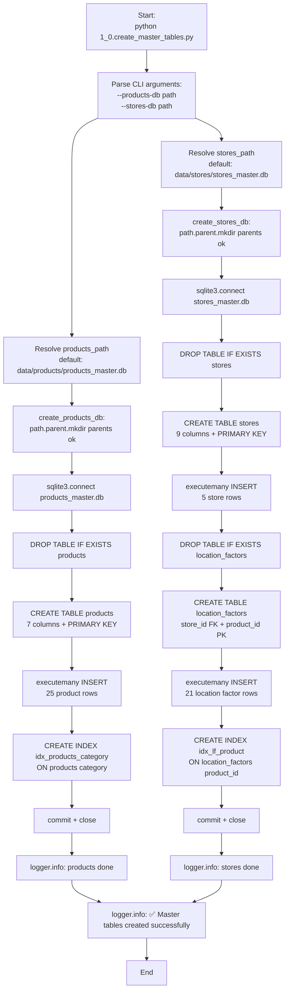
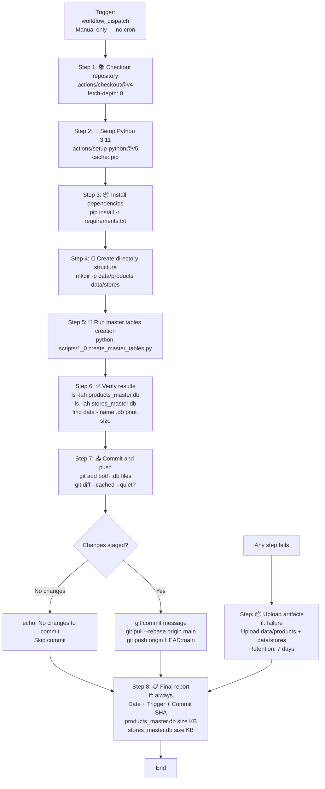
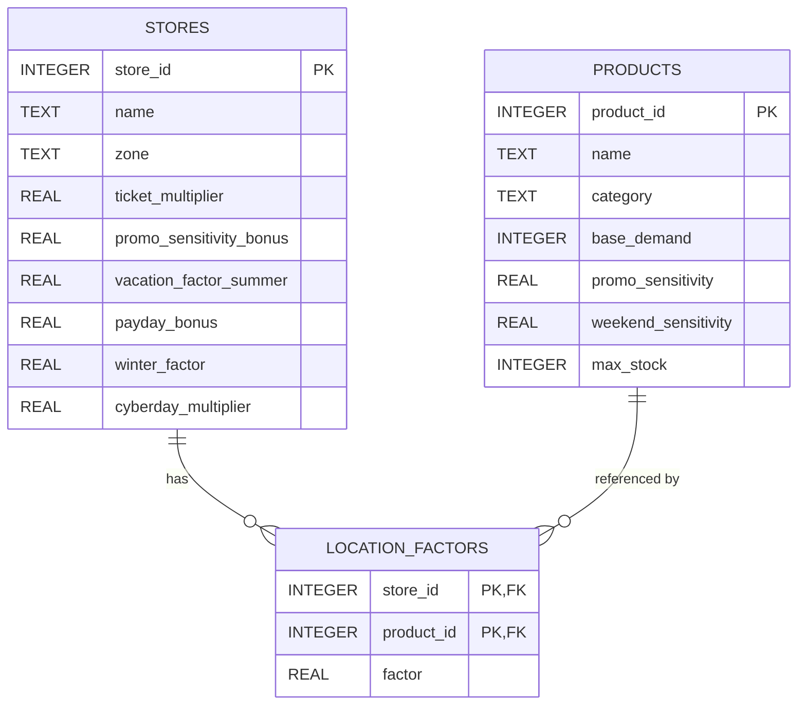
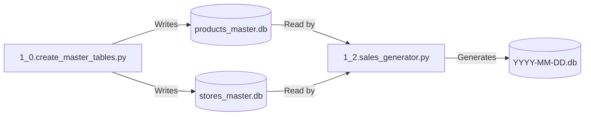

# 🏪 Script 1_0: Master Tables Generator

  

 

## 📥 Quick Downloads

| Document | Format |
| :--- | :--- |
| **🇬🇧 English Documentation** | [PDF](https://drive.google.com/file/d/1SdLvJnxcKxmQYmLlwoYttHr2Izud4iE5/view?usp=sharing) |
| **🇪🇸 Spanish Documentation** | [PDF](https://drive.google.com/file/d/11ANLX6PbK_eIzvHLPqL1rm9NY9rOshhD/view?usp=sharing) |

## 📋 General Description

This script initializes the **static master tables** required by the Sales Monitoring Engine. It creates two SQLite databases containing reference data that never changes (or changes very rarely): product definitions and store configurations.

Unlike Scripts 1_1 and 1_2 (which generate dynamic data daily), this script is **run once** when setting up the project, or whenever product or store definitions need to be updated. It has **no scheduled cron** — execution is always manual, either locally or via GitHub Actions `workflow_dispatch`.

### Key Features

- **Products Master Database**: 25 products across 7 categories with full attribute definitions (base demand, sensitivity, max stock)
- **Stores Master Database**: 5 stores with profiles (zone, ticket multiplier, seasonal and payday factors)
- **Location Factors Table**: 21 product-store-specific demand multipliers in a separate relational table
- **Automatic Directory Creation**: Creates `data/products/` and `data/stores/` if they don't exist, inside each creation function
- **Indexed Tables**: Pre-built indexes on `category` and `product_id` for fast JOIN queries with `sales_data`
- **Complete Replacement**: Each run drops and recreates all tables — no partial updates
- **Manual-Only Execution**: No cron schedule; designed for one-time or ad-hoc execution
- **CI/CD Ready**: GitHub Actions workflow with failure artifact upload and final execution report
- **Custom Output Paths**: `--products-db` and `--stores-db` arguments allow non-default paths
- **Zero External Dependencies**: Uses only Python standard library (`sqlite3`, `argparse`, `logging`, `pathlib`)

## 📊 Process Flow Diagrams

### **Legend**

| Color | Type | Description |
| :--- | :--- | :--- |
| 🔵 Blue | Input / Start | Hardcoded product/store data constants in Python |
| 🟠 Orange | Process | SQLite operations (DROP, CREATE, INSERT, INDEX) |
| 🔴 Red | Decision | Conditional branching (changes staged? failure?) |
| 🟢 Green | Storage | SQLite databases (`products_master.db`, `stores_master.db`) |
| 🟢 Dark Green | Output | Master databases committed and ready for downstream scripts |

---

### **Diagram 1: Script Execution Flow (`1_0.create_master_tables.py`)**



**Explanation of Diagram 1:**

The script receives two optional CLI arguments (`--products-db`, `--stores-db`) and resolves them to `Path` objects. It then calls two independent functions that each manage their own database connection from open to commit/close:

1. **`create_products_db(path)`**:
   - Calls `path.parent.mkdir(parents=True, exist_ok=True)` — directory is created inside the function, not as a separate step
   - Opens a fresh connection, drops the existing `products` table if present, and recreates it with 7 columns
   - Inserts all 25 rows with a single `executemany` call
   - Creates `idx_products_category` for fast `WHERE category = ?` filtering
   - Commits and closes the connection

2. **`create_stores_db(path)`**:
   - Same directory auto-creation pattern
   - Drops and recreates `stores` (9 columns) then `location_factors` (3 columns with composite PK and FK)
   - Inserts 5 store rows and 21 location factor rows in separate `executemany` calls
   - Creates `idx_lf_product` for fast joins between `location_factors` and `sales_data` on `product_id`
   - Commits and closes

Both functions are **independent**: if one raises an exception, the other still runs. No shared transaction or dependency between them.

---

### **Diagram 2: GitHub Actions Workflow (`1_0.create_master_tables.yml`)**



**Explanation of Diagram 2:**

The workflow has **8 sequential steps** plus a **conditional failure artifact** step. Key differences from a typical workflow:

- **Trigger**: `workflow_dispatch` only — no `schedule` cron. The workflow must be started manually from the GitHub Actions tab every time.
- **Step 3 — `requirements.txt`**: Dependencies are installed from the repository's `requirements.txt` file (not inline `pip install`). This ensures version consistency across all workflows in the project.
- **Step 4 — Directory creation**: `mkdir -p data/products data/stores` runs explicitly in the workflow even though the Python script also creates directories internally. This guarantees the paths exist before the script runs, regardless of how the script is called.
- **Step 7 — Commit with rebase**: The commit step checks `git diff --cached --quiet` before committing to avoid empty commits. If there are changes, it runs `git pull --rebase origin main` before pushing. This prevents conflicts when multiple workflows run in parallel on the same branch.
- **Failure artifact upload**: If any step fails, the workflow uploads `data/products/` and `data/stores/` as a debug artifact named `master-db-debug-{run_number}`, retained for 7 days. This is only triggered on failure (`if: failure()`).
- **Step 8 — Final report**: Runs with `if: always()` — it executes even if a previous step failed. It prints the current date, trigger event, commit SHA, and the file size in KB for each generated database using `stat -c%s`.

---

### **Diagram 3: Database Schema (ER Diagram)**



> **Note:** `PRODUCTS` and `STORES` live in **different database files**. The FK from `location_factors.product_id` → `products.product_id` is logical (not enforced at the SQLite engine level across files), but the composite PK `(store_id, product_id)` guarantees uniqueness within `stores_master.db`.

**Table Relationships:**

| Table | Database | Primary Key | Foreign Keys | Indexes |
| :--- | :--- | :--- | :--- | :--- |
| `products` | `products_master.db` | `product_id` | None | `idx_products_category` |
| `stores` | `stores_master.db` | `store_id` | None | None |
| `location_factors` | `stores_master.db` | (`store_id`, `product_id`) | `store_id → stores.store_id` | `idx_lf_product` |

---

## 🔍 Detailed Analysis of `1_0.create_master_tables.py`

### Code Structure

#### **1. Products Data (`PRODUCTS`)**

```python
PRODUCTS = [
    (1,  "Rice",         "grocery",   120, 0.4, 1.15, 600),
    (2,  "Noodles",      "grocery",   100, 0.6, 1.35, 500),
    # ... 25 products total
]
```

**Tuple Schema:**

| Position | Field | Type | Range | Description |
| :--- | :--- | :--- | :--- | :--- |
| 0 | `product_id` | int | 1–25 | Unique identifier; joins with `sales_data` |
| 1 | `name` | str | — | Product name in English |
| 2 | `category` | str | 7 values | Used for seasonal/holiday filtering in Script 1_2 |
| 3 | `base_demand` | int | 40–200 | Average daily units sold at a neutral store |
| 4 | `promo_sensitivity` | float | 0.2–0.9 | How strongly promotions boost demand |
| 5 | `weekend_sensitivity` | float | 1.10–2.00 | Demand multiplier on weekends vs weekdays |
| 6 | `max_stock` | int | 150–600 | Maximum inventory units per store |

**Categories and Products:**

| Category | Count | Products |
| :--- | :--- | :--- |
| `grocery` | 6 | Rice, Noodles, Oil, Flour, Sugar, Cookies |
| `dairy` | 4 | Milk, Cheese, Butter, Yogurt |
| `bakery` | 2 | Bread, Pastries |
| `fresh` | 5 | Meat, Fruits, Vegetables, Fish, Eggs |
| `beverages` | 3 | Soda, Juices, Yerba Mate |
| `alcohol` | 2 | Wines, Beer |
| `cleaning` | 3 | Detergent, Bleach, Toilet Paper |

**Demand and Sensitivity Reference:**

| Product | base_demand | promo_sensitivity | weekend_sensitivity | max_stock |
| :--- | :--- | :--- | :--- | :--- |
| Bread | 200 | 0.3 (low) | 1.40 | 200 |
| Cookies | 150 | 0.8 (high) | 1.50 | 400 |
| Beer | 80 | 0.9 (highest) | 2.00 (highest) | 400 |
| Fish | 45 (lowest) | 0.2 (lowest) | 1.40 | 150 (lowest) |
| Soda | 130 | 0.9 (highest) | 1.60 | 500 |

#### **2. Stores Data (`STORES`)**

```python
STORES = [
    (1, "Santiago Centro", "urban_center",      0.90,  0.10, 0.90, 0.20, 1.00, 1.00),
    (2, "Alto Santiago",   "premium",           1.40, -0.15, 0.70, 0.15, 1.00, 1.00),
    (3, "Santiago Popular","popular",           0.70,  0.25, 1.00, 0.35, 1.00, 2.00),
    (4, "Rancagua",        "regional_center",   0.85,  0.15, 1.10, 0.20, 1.00, 1.00),
    (5, "Vina del Mar",    "coastal_touristic", 1.00,  0.05, 1.50, 0.20, 0.85, 1.00),
]
```

**Tuple Schema:**

| Position | Field | Type | Description |
| :--- | :--- | :--- | :--- |
| 0 | `store_id` | int | Unique identifier (1–5) |
| 1 | `name` | str | Store name |
| 2 | `zone` | str | Zone classification |
| 3 | `ticket_multiplier` | float | Average revenue per unit vs baseline (0.70 = cheaper, 1.40 = premium) |
| 4 | `promo_sensitivity_bonus` | float | Added to base promotion probability; can be negative (Alto Santiago: -0.15) |
| 5 | `vacation_factor_summer` | float | Summer demand modifier (1.50 = +50% in Vina del Mar) |
| 6 | `payday_bonus` | float | Demand increase on payday days (days 1–5 and last 3 of month) |
| 7 | `winter_factor` | float | Winter demand modifier (0.85 in Vina del Mar = -15% off-season) |
| 8 | `cyberday_multiplier` | float | Extra boost during CyberDay event (2.00 in Santiago Popular) |

**Store Profiles:**

| Store | Zone | ticket_mult | promo_bonus | summer | winter | CyberDay |
| :--- | :--- | :--- | :--- | :--- | :--- | :--- |
| Santiago Centro | urban_center | 0.90 | +0.10 | 0.90 | 1.00 | 1.00× |
| Alto Santiago | premium | 1.40 | -0.15 | 0.70 | 1.00 | 1.00× |
| Santiago Popular | popular | 0.70 | +0.25 | 1.00 | 1.00 | 2.00× |
| Rancagua | regional_center | 0.85 | +0.15 | 1.10 | 1.00 | 1.00× |
| Vina del Mar | coastal_touristic | 1.00 | +0.05 | 1.50 | 0.85 | 1.00× |

**Zone Characteristics:**

| Zone | Store | Characteristics |
| :--- | :--- | :--- |
| `urban_center` | Santiago Centro | High office-hour traffic; lower ticket; bread and alcohol above average |
| `premium` | Alto Santiago | High purchasing power; premium products (cheese, wines, meat); fewer basics (rice -20%) |
| `popular` | Santiago Popular | Volume-driven; price-sensitive; staples (rice, noodles, flour, bread) dominant; CyberDay 2× boost |
| `regional_center` | Rancagua | Traditional consumption; regional habits (yerba mate +40%, eggs +30%); stable year-round |
| `coastal_touristic` | Vina del Mar | Strong summer seasonality (+50%); beer +120%; fish +80%; winter drops -15% |

#### **3. Location Factors (`LOCATION_FACTORS`)**

```python
LOCATION_FACTORS = [
    (1, 11, 1.3),   # Santiago Centro: Bread +30%
    (2,  8, 1.6),   # Alto Santiago: Cheese +60%
    # ... 21 factors total
]
```

**Tuple Schema:**

| Position | Field | Type | Description |
| :--- | :--- | :--- | :--- |
| 0 | `store_id` | int | Store identifier (1–5); FK → `stores.store_id` |
| 1 | `product_id` | int | Product identifier (1–25); logical FK → `products.product_id` |
| 2 | `factor` | float | Demand multiplier (0.8 = -20% to 2.2 = +120%) |

**Complete Factor Table:**

| Store | product_id | Product | Factor | Effect |
| :--- | :--- | :--- | :--- | :--- |
| Santiago Centro | 11 | Bread | 1.3 | +30% |
| Santiago Centro | 21 | Wines | 1.4 | +40% |
| Santiago Centro | 22 | Beer | 1.3 | +30% |
| Alto Santiago | 8 | Cheese | 1.6 | +60% |
| Alto Santiago | 21 | Wines | 1.8 | +80% |
| Alto Santiago | 13 | Meat | 1.5 | +50% |
| Alto Santiago | 1 | Rice | 0.8 | -20% |
| Santiago Popular | 1 | Rice | 1.4 | +40% |
| Santiago Popular | 2 | Noodles | 1.4 | +40% |
| Santiago Popular | 3 | Oil | 1.3 | +30% |
| Santiago Popular | 4 | Flour | 1.3 | +30% |
| Santiago Popular | 5 | Sugar | 1.3 | +30% |
| Santiago Popular | 11 | Bread | 1.5 | +50% |
| Rancagua | 4 | Flour | 1.3 | +30% |
| Rancagua | 17 | Eggs | 1.3 | +30% |
| Rancagua | 20 | Yerba Mate | 1.4 | +40% |
| Rancagua | 13 | Meat | 1.2 | +20% |
| Vina del Mar | 22 | Beer | 2.2 | +120% |
| Vina del Mar | 16 | Fish | 1.8 | +80% |
| Vina del Mar | 14 | Fruits | 1.6 | +60% |
| Vina del Mar | 15 | Vegetables | 1.6 | +60% |

> Products not listed for a store default to `factor = 1.0` (no location adjustment) in Script 1_2.

#### **4. Products Database Schema**

```sql
CREATE TABLE products (
    product_id          INTEGER PRIMARY KEY,
    name                TEXT    NOT NULL,
    category            TEXT    NOT NULL,
    base_demand         INTEGER NOT NULL,
    promo_sensitivity   REAL    NOT NULL,
    weekend_sensitivity REAL    NOT NULL,
    max_stock           INTEGER NOT NULL
);

CREATE INDEX idx_products_category ON products(category);
```

**Column Details:**

| Column | Type | Constraints | Used by Script 1_2 for |
| :--- | :--- | :--- | :--- |
| `product_id` | INTEGER | PRIMARY KEY | Join with `sales_data` |
| `name` | TEXT | NOT NULL | Display / logging |
| `category` | TEXT | NOT NULL | Seasonal and holiday filtering; `FRESH_PRODUCTS` classification |
| `base_demand` | INTEGER | NOT NULL | Baseline demand before multipliers |
| `promo_sensitivity` | REAL | NOT NULL | Promotion probability calculation |
| `weekend_sensitivity` | REAL | NOT NULL | `weekend_factor` in `_calculate_base_demand` |
| `max_stock` | INTEGER | NOT NULL | Stockout ratio calculation; restock threshold |

#### **5. Stores Database Schema**

```sql
CREATE TABLE stores (
    store_id                INTEGER PRIMARY KEY,
    name                    TEXT    NOT NULL,
    zone                    TEXT    NOT NULL,
    ticket_multiplier       REAL    NOT NULL,
    promo_sensitivity_bonus REAL    NOT NULL,
    vacation_factor_summer  REAL    NOT NULL,
    payday_bonus            REAL    NOT NULL,
    winter_factor           REAL    NOT NULL DEFAULT 1.0,
    cyberday_multiplier     REAL    NOT NULL DEFAULT 1.0
);

CREATE TABLE location_factors (
    store_id    INTEGER NOT NULL REFERENCES stores(store_id),
    product_id  INTEGER NOT NULL,
    factor      REAL    NOT NULL,
    PRIMARY KEY (store_id, product_id)
);

CREATE INDEX idx_lf_product ON location_factors(product_id);
```

**Stores Column Details:**

| Column | Type | Default | Description |
| :--- | :--- | :--- | :--- |
| `store_id` | INTEGER | — | PRIMARY KEY; joins with `sales_data` |
| `name` | TEXT | — | Display name |
| `zone` | TEXT | — | Zone classification for grouping |
| `ticket_multiplier` | REAL | — | Revenue per unit multiplier applied in `generate_daily_sales` |
| `promo_sensitivity_bonus` | REAL | — | Added to `prob` in `get_promotion()`; can be negative |
| `vacation_factor_summer` | REAL | — | Applied to all products during Dec–Feb in `get_seasonal_factor` |
| `payday_bonus` | REAL | — | Added to base demand on payday days |
| `winter_factor` | REAL | 1.0 | Applied during Jun–Aug; only Vina del Mar has 0.85 |
| `cyberday_multiplier` | REAL | 1.0 | Extra event multiplier layered on top of Script 1_1 confidence factor |

---

## ⚙️ GitHub Actions Workflow Analysis (`1_0.create_master_tables.yml`)

### Workflow Overview

```yaml
name: 1_0. Create Master Tables

on:
  workflow_dispatch:    # Manual trigger only — no cron schedule

permissions:
  contents: write       # Required to commit generated .db files

jobs:
  build-master:
    name: 🏗️ Build Master Databases
    runs-on: ubuntu-latest
    timeout-minutes: 15
```

### Step-by-Step Analysis

| Step | Name | Condition | Purpose |
| :--- | :--- | :--- | :--- |
| 1 | 📚 Checkout repository | Always | Clone with full history for safe rebase push |
| 2 | 🐍 Setup Python 3.11 | Always | Install runtime with pip cache enabled |
| 3 | 📦 Install dependencies | Always | `pip install -r requirements.txt` |
| 4 | 📁 Create directory structure | Always | `mkdir -p data/products data/stores` |
| 5 | 🚀 Run master tables creation | Always | Execute the Python script with default paths |
| 6 | ✅ Verify results | Always | `ls -lah` each `.db` file; `find` for size summary |
| 7 | 📤 Commit and push | Always | Stage, check diff, commit + rebase + push |
| — | 📦 Upload artifacts | `if: failure()` | Upload both `data/` dirs as debug artifact |
| 8 | 📋 Final report | `if: always()` | Print date, trigger, SHA, and file sizes in KB |

#### **Step 1: 📚 Checkout Repository**

```yaml
- name: 📚 Checkout repository
  uses: actions/checkout@v4
  with:
    fetch-depth: 0
```

`fetch-depth: 0` pulls full Git history. Required for `git pull --rebase` in Step 7 to work correctly without shallow-clone conflicts.

#### **Step 2: 🐍 Setup Python**

```yaml
- name: 🐍 Setup Python
  uses: actions/setup-python@v5
  with:
    python-version: '3.11'
    cache: 'pip'
```

`cache: 'pip'` speeds up repeated runs by reusing the pip cache from previous workflow executions.

#### **Step 3: 📦 Install Dependencies**

```yaml
- name: 📦 Install dependencies
  run: |
    pip install -r requirements.txt
```

Dependencies are read from the repository's shared `requirements.txt`. This script itself uses only the Python standard library, but other scripts in the project (pandas, numpy, openai) share the same file — installing from `requirements.txt` ensures all dependencies are consistent across the project.

#### **Step 4: 📁 Create Directory Structure**

```yaml
- name: 📁 Create directory structure
  run: |
    mkdir -p data/products data/stores
```

This step is a safety guarantee — it creates the output directories before the Python script runs. Although `create_products_db()` and `create_stores_db()` both call `path.parent.mkdir(parents=True, exist_ok=True)` internally, having an explicit shell step makes the workflow self-documenting and prevents edge cases where the Python script might fail before reaching the mkdir call.

#### **Step 5: 🚀 Run Master Tables Creation**

```yaml
- name: 🚀 Run master tables creation
  run: |
    python scripts/1_0.create_master_tables.py
```

Runs with default paths (`data/products/products_master.db` and `data/stores/stores_master.db`). To use custom paths, add `--products-db` and `--stores-db` arguments here.

**Expected log output:**

```text
2026-05-13 10:00:01 - INFO - products_master.db → 25 products  [data/products/products_master.db]
2026-05-13 10:00:01 - INFO - stores_master.db   → 5 stores, 21 location_factors  [data/stores/stores_master.db]
2026-05-13 10:00:01 - INFO - ✅ Master tables created successfully.
```

#### **Step 6: ✅ Verify Results**

```yaml
- name: ✅ Verify results
  run: |
    echo "📊 Verifying execution results..."

    echo "📂 Products database:"
    ls -lah data/products/products_master.db 2>/dev/null || echo "❌ products_master.db not found"

    echo -e "\n📂 Stores database:"
    ls -lah data/stores/stores_master.db 2>/dev/null || echo "❌ stores_master.db not found"

    echo -e "\n📈 File statistics:"
    find data/products data/stores -type f -name "*.db" -exec ls -lh {} \; 2>/dev/null | awk '{print $5, $9}'
```

This step verifies both files exist and prints their size. It uses `2>/dev/null || echo "❌ not found"` so a missing file produces a readable error in the log without failing the step — failure is handled by the artifact upload in the next conditional step.

**Expected output:**

```text
📂 Products database:
-rw-r--r-- 1 runner runner 8.0K May 13 10:00 data/products/products_master.db

📂 Stores database:
-rw-r--r-- 1 runner runner 12K  May 13 10:00 data/stores/stores_master.db

📈 File statistics:
8.0K data/products/products_master.db
12K  data/stores/stores_master.db
```

#### **Step 7: 📤 Commit and Push**

```yaml
- name: 📤 Commit and push changes
  run: |
    git config user.name "github-actions[bot]"
    git config user.email "github-actions[bot]@users.noreply.github.com"

    git add data/products/products_master.db data/stores/stores_master.db

    if git diff --cached --quiet; then
      echo "🔭 No changes to commit"
    else
      git commit -m "📦 Update master databases [automated]"

      echo "⬇️ Pulling latest changes with rebase..."
      git pull --rebase origin main

      echo "⬆️ Pushing changes to repository..."
      git push origin HEAD:main
      echo "✅ Changes pushed successfully"
    fi
```

**Key behaviors:**

| Behavior | Detail |
| :--- | :--- |
| **Empty commit guard** | `git diff --cached --quiet` checks whether anything was actually staged. If the databases haven't changed (same data re-run), no commit is made and the step exits cleanly with "No changes to commit". |
| **Rebase before push** | `git pull --rebase origin main` is executed before pushing. This prevents push failures when another workflow has committed to `main` between this workflow's checkout and its push — a common race condition when multiple workflows run in parallel. |
| **Push target** | `git push origin HEAD:main` explicitly pushes the current HEAD to `main`, avoiding ambiguity in detached-HEAD scenarios. |

#### **Failure Artifact Upload (Conditional)**

```yaml
- name: 📦 Upload artifacts (on failure)
  if: failure()
  uses: actions/upload-artifact@v4
  with:
    name: master-db-debug-${{ github.run_number }}
    path: |
      data/products/
      data/stores/
    retention-days: 7
```

This step only runs if any previous step fails (`if: failure()`). It uploads the entire `data/products/` and `data/stores/` directories as a named artifact (e.g., `master-db-debug-42`), retained for 7 days. This allows debugging partial writes or schema errors without needing to reproduce the failure locally.

#### **Step 8: 📋 Final Report**

```yaml
- name: 📋 Final report
  if: always()
  run: |
    echo "========================================"
    echo "🗄️ MASTER TABLES EXECUTION REPORT"
    echo "========================================"
    echo "📅 Date: $(date)"
    echo "📌 Trigger: ${{ github.event_name }}"
    echo "🔗 Commit: ${{ github.sha }}"
    echo ""

    if [ -f "data/products/products_master.db" ]; then
      SIZE=$(stat -c%s "data/products/products_master.db")
      echo "✅ products_master.db: $((SIZE / 1024)) KB"
    else
      echo "❌ products_master.db not found"
    fi

    if [ -f "data/stores/stores_master.db" ]; then
      SIZE=$(stat -c%s "data/stores/stores_master.db")
      echo "✅ stores_master.db: $((SIZE / 1024)) KB"
    else
      echo "❌ stores_master.db not found"
    fi

    echo ""
    echo "✅ Process completed"
    echo "========================================"
```

This step runs with `if: always()` — it executes whether the workflow succeeded or failed. It prints execution context (`date`, `github.event_name`, `github.sha`) and checks each database file individually, reporting its size in KB via `stat -c%s` (bytes) divided by 1024. This gives a persistent audit trail in the GitHub Actions log.

### How to Trigger Manually

1. Go to the **Actions** tab in the repository
2. Select **1_0. Create Master Tables** from the left sidebar
3. Click **Run workflow** → select branch `main` → click **Run workflow**
4. Wait for the job `🏗️ Build Master Databases` to complete (~10–30 seconds)
5. The databases are committed automatically to `data/products/` and `data/stores/`

> **When to re-run:** Only when you modify `PRODUCTS`, `STORES`, or `LOCATION_FACTORS` in the script. Re-running without changes produces "No changes to commit" and exits cleanly.

---

## 🚀 Installation and Local Setup

### Prerequisites

- Python 3.11 or higher
- No external packages required — uses only Python standard library (`sqlite3`, `argparse`, `logging`, `pathlib`)
- SQLite3 CLI (optional, for verification)

### Step-by-Step Setup

#### 1. Clone the Repository

```bash
git clone https://github.com/adroguetth/Sales-Monitoring-Engine.git
cd Sales-Monitoring-Engine
```

#### 2. Run the Script (Default Paths)

```bash
python scripts/1_0.create_master_tables.py
```

**Expected log output:**

```text
2026-05-13 10:00:01 - INFO - products_master.db → 25 products  [data/products/products_master.db]
2026-05-13 10:00:01 - INFO - stores_master.db   → 5 stores, 21 location_factors  [data/stores/stores_master.db]
2026-05-13 10:00:01 - INFO - ✅ Master tables created successfully.
```

#### 3. Verify Output

```bash
# Check files exist
ls -lah data/products/products_master.db
ls -lah data/stores/stores_master.db

# Verify row counts
sqlite3 data/products/products_master.db "SELECT COUNT(*) FROM products;"
sqlite3 data/stores/stores_master.db "SELECT COUNT(*) FROM stores;"
sqlite3 data/stores/stores_master.db "SELECT COUNT(*) FROM location_factors;"
```

**Expected:**

```text
25
5
21
```

#### 4. Custom Output Paths (Optional)

```bash
python scripts/1_0.create_master_tables.py \
    --products-db ./custom/products.db \
    --stores-db ./custom/stores.db
```

Both paths are independent — you can override one without the other.

#### 5. Query Examples

```bash
# Products by category
sqlite3 data/products/products_master.db \
  "SELECT category, COUNT(*), AVG(base_demand) FROM products GROUP BY category;"

# Stores with summer boost > 1.0
sqlite3 data/stores/stores_master.db \
  "SELECT name, vacation_factor_summer FROM stores WHERE vacation_factor_summer > 1.0;"

# Location factors above 1.5 (significant boosts)
sqlite3 data/stores/stores_master.db \
  "SELECT store_id, product_id, factor FROM location_factors WHERE factor >= 1.5 ORDER BY factor DESC;"
```

---

## 📁 Generated File Structure

```text
Sales-Monitoring-Engine/
├── data/
│   ├── products/
│   │   └── products_master.db          # 25 products, ~8 KB
│   └── stores/
│       └── stores_master.db            # 5 stores + 21 location factors, ~12 KB
├── scripts/
│   └── 1_0.create_master_tables.py     # This script
├── requirements.txt                    # Shared project dependencies
└── .github/
    └── workflows/
        └── 1_0.create_master_tables.yml   # Manual-only workflow
```

### Database Contents Summary

| Database | Tables | Rows | Indexes | Size (approx) |
| :--- | :--- | :--- | :--- | :--- |
| `products_master.db` | 1 (`products`) | 25 | 1 (`idx_products_category`) | ~8 KB |
| `stores_master.db` | 2 (`stores`, `location_factors`) | 5 + 21 = 26 | 1 (`idx_lf_product`) | ~12 KB |
| **Total** | **3 tables** | **51 rows** | **2 indexes** | **~20 KB** |

---

## 🔧 Customization

### Adding a New Product

1. Add a tuple to `PRODUCTS` in the script:

```python
PRODUCTS.append(
    (26, "Olive Oil", "grocery", 55, 0.35, 1.12, 350)
)
```

2. Optionally add location factors for specific stores:

```python
LOCATION_FACTORS.append(
    (2, 26, 1.4)  # Alto Santiago: Olive Oil +40% (premium store)
)
```

3. Re-run the script locally or trigger the workflow manually.

### Adding a New Store

1. Add a tuple to `STORES`:

```python
STORES.append(
    (6, "Concepcion", "regional_center", 0.80, 0.10, 1.05, 0.25, 1.00, 1.00)
)
```

2. Add relevant location factors:

```python
LOCATION_FACTORS.extend([
    (6, 20, 1.5),  # Concepcion: Yerba Mate +50%
    (6, 13, 1.3),  # Concepcion: Meat +30%
])
```

3. Re-run the script. Note: Script 1_2 iterates over `STORES` directly from its own constants — adding a store here does **not** automatically generate sales for that store until Script 1_2 is also updated.

### Important Notes

- **No automatic updates**: The script has no cron schedule. Run it manually whenever `PRODUCTS`, `STORES`, or `LOCATION_FACTORS` change.
- **Complete replacement**: Each run drops and fully recreates all tables. There is no append or merge mode.
- **Version control**: The generated `.db` files are committed to the repository after each run, so all changes are tracked in Git history.
- **Cross-database FK**: The `location_factors.product_id` column references `products.product_id` logically, but SQLite does not enforce this FK across separate database files. Consistency must be maintained manually.

---

## 🐛 Troubleshooting

| Error | Likely Cause | Solution |
| :--- | :--- | :--- |
| `Permission denied: data/products/` | Directory not writable | Run `mkdir -p data/products data/stores` manually |
| `No such table: products` | Script not run yet | Run `python scripts/1_0.create_master_tables.py` |
| `UNIQUE constraint failed` | Duplicate `product_id` or `store_id` | Check for duplicate IDs in `PRODUCTS` or `STORES` lists |
| `sqlite3.OperationalError: no such table` | Script not run in this environment | Run the script to create tables |
| `File not found: scripts/1_0.create_master_tables.py` | Wrong working directory | Run from repository root: `cd Sales-Monitoring-Engine` |
| Workflow: `No changes to commit` | Data hasn't changed | Normal behavior; databases are already up to date |
| Workflow: push rejected | Concurrent push on `main` | The `git pull --rebase` step handles this; retry if it fails |
| Artifact not uploaded | Workflow succeeded (no failure) | Upload only triggers on `if: failure()` |

---

## 📈 Monitoring and Maintenance

### When to Re-Run

| Situation | Action |
| :--- | :--- |
| Adding or renaming products | Edit `PRODUCTS`, re-run script |
| Adding or reconfiguring stores | Edit `STORES` and `LOCATION_FACTORS`, re-run |
| New environment setup | Run once as part of project initialization |
| Recovering from corrupted databases | Re-run with `--products-db` / `--stores-db` pointing to the target path |
| Verifying data integrity | Query with `sqlite3` (see Step 5 above) |

### Health Check

```bash
# Quick integrity check
python3 - <<'EOF'
import sqlite3

products = sqlite3.connect("data/products/products_master.db")
stores   = sqlite3.connect("data/stores/stores_master.db")

p_count = products.execute("SELECT COUNT(*) FROM products").fetchone()[0]
s_count = stores.execute("SELECT COUNT(*) FROM stores").fetchone()[0]
lf_count = stores.execute("SELECT COUNT(*) FROM location_factors").fetchone()[0]

assert p_count == 25, f"Expected 25 products, got {p_count}"
assert s_count == 5,  f"Expected 5 stores, got {s_count}"
assert lf_count == 21, f"Expected 21 location factors, got {lf_count}"

print(f"✅ products: {p_count} | stores: {s_count} | location_factors: {lf_count}")
EOF
```

---

## 🔗 Dependencies and Integration

### Upstream Dependencies

None. This is the **first script** in the pipeline. All data is hardcoded as Python constants in the script itself.

### Downstream Consumers

| Script | What it reads | How it uses it |
| :--- | :--- | :--- |
| `1_2.sales_generator.py` | `products_master.db` → `products` table | `base_demand`, `promo_sensitivity`, `weekend_sensitivity`, `max_stock` |
| `1_2.sales_generator.py` | `stores_master.db` → `stores` table | `ticket_multiplier`, `promo_sensitivity_bonus`, all seasonal/payday factors |
| `1_2.sales_generator.py` | `stores_master.db` → `location_factors` table | Per-product demand adjustments per store |

### Integration Flow



---

## 📄 License and Attribution

- **License**: MIT
- **Author**: Alfonso Droguett
  - 🔗 **LinkedIn:** [Alfonso Droguett](https://www.linkedin.com/in/adroguetth/)
  - 🌐 **Web portfolio:** [adroguett-portfolio.cl](https://www.adroguett-portfolio.cl/)
  - 📧 **Email:** adroguett.consultor@gmail.com
- **Dependencies**: None (Python standard library only: `sqlite3`, `argparse`, `logging`, `pathlib`)

---

## 🤝 Contribution

1. Run the script locally after any changes to `PRODUCTS`, `STORES`, or `LOCATION_FACTORS`
2. Commit both the script changes **and** the regenerated `.db` files in the same commit
3. Verify with the health check script before pushing
4. Keep `product_id` values unique and stable — downstream scripts reference them by integer ID
5. Document any new products or stores in this README (Categories table, Zone Characteristics table, Location Factors table)
6. Do not add a cron schedule to the workflow — this script is intentionally manual-only

---

**⭐ If this project is useful to you, please consider giving it a star on GitHub!**
