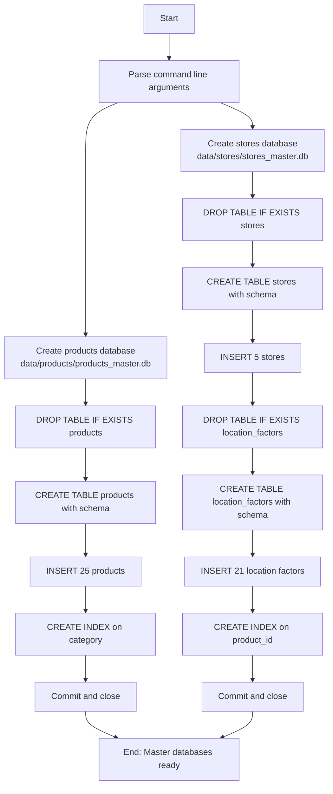
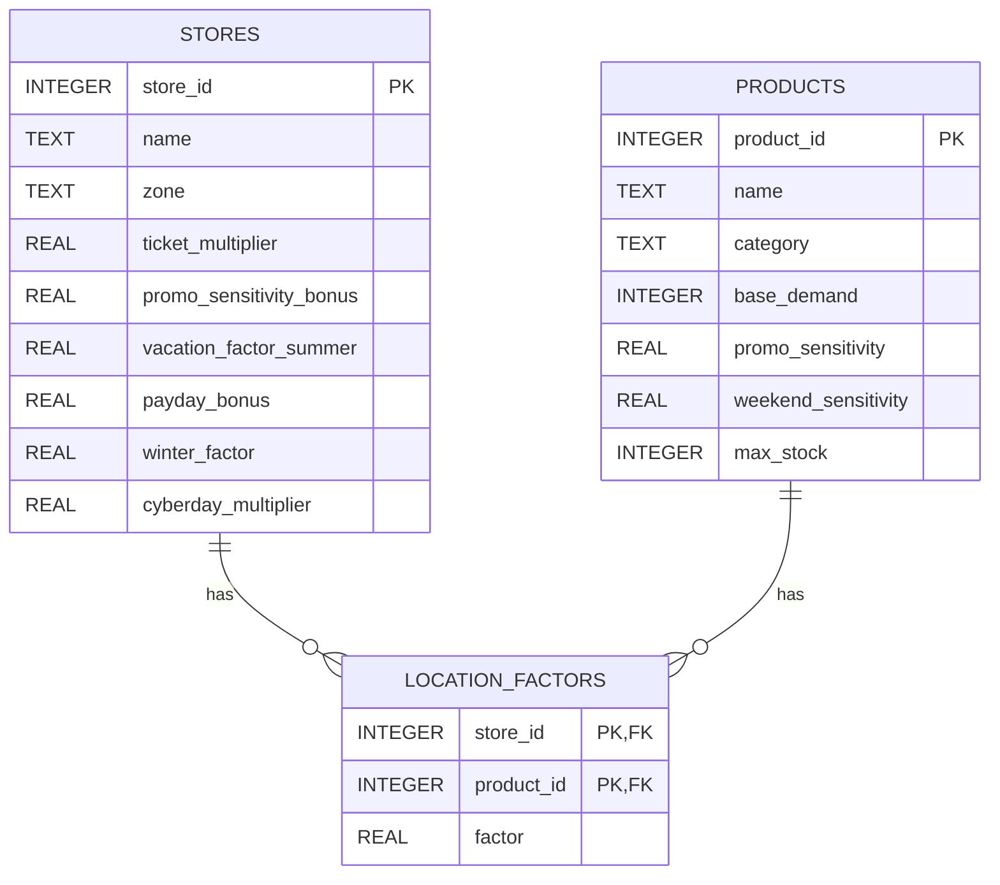

# 🏪 Script 1_0: Master Tables Generator

  

 

## 📥 Quick Downloads

| Document | Format |
| :--- | :--- |
| **🇬🇧 English Documentation** | [PDF](https://drive.google.com/file/d/1SdLvJnxcKxmQYmLlwoYttHr2Izud4iE5/view?usp=sharing) |
| **🇪🇸 Spanish Documentation** | [PDF](https://drive.google.com/file/d/11ANLX6PbK_eIzvHLPqL1rm9NY9rOshhD/view?usp=sharing) |

## 📋 General Description

This script initializes the **static master tables** required by the Sales Monitoring Engine. It creates two SQLite databases containing reference data that never changes (or changes very rarely): product definitions and store configurations.

Unlike Scripts 1_1 and 1_2 (which generate dynamic data daily), this script is **run once** when setting up the project, or whenever product or store definitions need to be updated.

### Key Features

- **Products Master Database**: 25 products with attributes (base demand, category, sensitivity, max stock)
- **Stores Master Database**: 5 stores with profiles (zone, multipliers, location‑specific factors)
- **Location Factors Table**: 21 product‑store specific demand multipliers
- **Automatic Directory Creation**: Creates `data/products/` and `data/stores/` if they don't exist
- **Indexed Tables**: Pre‑built indexes for fast JOIN queries
- **Manual Only Execution**: Designed for one‑time or ad‑hoc execution (no automated cron)
- **CI/CD Ready**: Includes GitHub Actions workflow for manual execution
- **Relationships Ready**: Foreign keys and indexes set up for future integration with Script 1_2

## 📊 Process Flow Diagram

### **Legend**

| Color | Type | Description |
| :--- | :--- | :--- |
| 🔵 Blue | Input / Start | Hardcoded product/store data in Python |
| 🟠 Orange | Process | SQLite table creation, data insertion |
| 🟢 Green | Storage | SQLite databases (`products_master.db`, `stores_master.db`) |
| 🟢 Dark Green | Output | Master databases ready for other scripts |

### **Diagram 1: Main Flow Overview**




**Explanation of Diagram 1:**

The script performs two independent database creation processes:

1. **Products Database** (`data/products/products_master.db`):
   - Drops existing `products` table (if any)
   - Creates new `products` table with 7 columns
   - Inserts 25 product records (from `PRODUCTS` list)
   - Creates index on `category` column for faster filtering
   - Closes connection
2. **Stores Database** (`data/stores/stores_master.db`):
   - Drops existing `stores` and `location_factors` tables (if any)
   - Creates `stores` table with 9 columns
   - Inserts 5 store records (from `STORES` list)
   - Creates `location_factors` table with foreign key references
   - Inserts 21 location factor records (store × product specific multipliers)
   - Creates index on `product_id` for faster joins
   - Closes connection

Both databases are created independently. If one fails, the other still succeeds (no transaction dependency).

### **Diagram 2: Database Schema**



**Table Relationships:**

| Table              | Primary Key                | Foreign Keys                                                 | Indexes                 |
| :----------------- | :------------------------- | :----------------------------------------------------------- | :---------------------- |
| `products`         | `product_id`               | None                                                         | `idx_products_category` |
| `stores`           | `store_id`                 | None                                                         | None                    |
| `location_factors` | (`store_id`, `product_id`) | `store_id` → `stores.store_id`, `product_id` → `products.product_id` | `idx_lf_product`        |

## 🔍 Detailed Analysis of `1_0.create_master_tables.py`

### Code Structure

#### **1. Products Data Structure**

```python
PRODUCTS = [
    (1,  "Rice",           "grocery",     120, 0.4, 1.15, 600),
    (2,  "Noodles",        "grocery",     100, 0.6, 1.35, 500),
    # ... 25 products total
]
```


**Tuple Schema:**

| Position | Field                 | Type  | Description                                   |
| :------- | :-------------------- | :---- | :-------------------------------------------- |
| 0        | `product_id`          | int   | Unique identifier (1-25)                      |
| 1        | `name`                | str   | Product name in English                       |
| 2        | `category`            | str   | Product category                              |
| 3        | `base_demand`         | int   | Average daily units sold                      |
| 4        | `promo_sensitivity`   | float | How much promotions increase demand (0.2-0.9) |
| 5        | `weekend_sensitivity` | float | Weekend multiplier (1.10-2.00)                |
| 6        | `max_stock`           | int   | Maximum inventory capacity                    |

**Categories Used:**

| Category    | Products | Examples                                  |
| :---------- | :------- | :---------------------------------------- |
| `grocery`   | 6        | Rice, Noodles, Oil, Flour, Sugar, Cookies |
| `dairy`     | 4        | Milk, Cheese, Butter, Yogurt              |
| `bakery`    | 2        | Bread, Pastries                           |
| `fresh`     | 5        | Meat, Fruits, Vegetables, Fish, Eggs      |
| `beverages` | 3        | Soda, Juices, Yerba Mate                  |
| `alcohol`   | 2        | Wines, Beer                               |
| `cleaning`  | 3        | Detergent, Bleach, Toilet Paper           |

#### **2. Stores Data Structure**

```python
STORES = [
    (1, "Santiago Centro", "urban_center",      0.90,  0.10, 0.90, 0.20, 1.00, 1.00),
    (2, "Alto Santiago",   "premium",           1.40, -0.15, 0.70, 0.15, 1.00, 1.00),
    # ... 5 stores total
]
```

**Tuple Schema:**

| Position | Field                     | Type  | Description                      |
| :------- | :------------------------ | :---- | :------------------------------- |
| 0        | `store_id`                | int   | Unique identifier (1-5)          |
| 1        | `name`                    | str   | Store name                       |
| 2        | `zone`                    | str   | Zone classification              |
| 3        | `ticket_multiplier`       | float | Average ticket size vs baseline  |
| 4        | `promo_sensitivity_bonus` | float | Additional promotion probability |
| 5        | `vacation_factor_summer`  | float | Summer demand adjustment         |
| 6        | `payday_bonus`            | float | Payday demand increase           |
| 7        | `winter_factor`           | float | Winter demand adjustment         |
| 8        | `cyberday_multiplier`     | float | CyberDay event boost             |

**Store Zones:**

| Zone                | Stores           | Characteristics                          |
| :------------------ | :--------------- | :--------------------------------------- |
| `urban_center`      | Santiago Centro  | High office traffic, lower ticket        |
| `premium`           | Alto Santiago    | High purchasing power, premium products  |
| `popular`           | Santiago Popular | Volume‑driven, price sensitive           |
| `regional_center`   | Rancagua         | Traditional consumption, regional habits |
| `coastal_touristic` | Vina del Mar     | Seasonal tourism, beach products         |

#### **3. Location Factors Structure**

```python
LOCATION_FACTORS = [
    (1, 11, 1.3),   # Santiago Centro: Bread +30%
    (2,  8, 1.6),   # Alto Santiago: Cheese +60%
    # ... 21 factors total
]
```

**Tuple Schema:**

| Position | Field        | Type  | Description                                 |
| :------- | :----------- | :---- | :------------------------------------------ |
| 0        | `store_id`   | int   | Store identifier (1-5)                      |
| 1        | `product_id` | int   | Product identifier (1-25)                   |
| 2        | `factor`     | float | Demand multiplier (0.8 = -20%, 2.2 = +120%) |

**Factor Examples:**

| Store         | Product    | Factor | Effect                                       |
| :------------ | :--------- | :----- | :------------------------------------------- |
| Alto Santiago | Cheese     | 1.6    | +60% demand (premium store)                  |
| Alto Santiago | Rice       | 0.8    | -20% demand (premium store buys less basics) |
| Vina del Mar  | Beer       | 2.2    | +120% demand (coastal summer)                |
| Puente Alto   | Bread      | 1.5    | +50% demand (high volume store)              |
| Rancagua      | Yerba Mate | 1.4    | +40% demand (regional habit)                 |

#### **4. Products Database Schema**

```sqlite
CREATE TABLE products (
    product_id          INTEGER PRIMARY KEY,
    name                TEXT    NOT NULL,
    category            TEXT    NOT NULL,
    base_demand         INTEGER NOT NULL,
    promo_sensitivity   REAL    NOT NULL,
    weekend_sensitivity REAL    NOT NULL,
    max_stock           INTEGER NOT NULL
);

CREATE INDEX idx_products_category ON products(category);
```

**Column Details:**

| Column                | Type    | Constraints | Purpose                           |
| :-------------------- | :------ | :---------- | :-------------------------------- |
| `product_id`          | INTEGER | PRIMARY KEY | Joins with sales_data             |
| `name`                | TEXT    | NOT NULL    | Display name                      |
| `category`            | TEXT    | NOT NULL    | Used for seasonal/holiday effects |
| `base_demand`         | INTEGER | NOT NULL    | Baseline daily demand             |
| `promo_sensitivity`   | REAL    | NOT NULL    | Promotion effectiveness           |
| `weekend_sensitivity` | REAL    | NOT NULL    | Weekend multiplier                |
| `max_stock`           | INTEGER | NOT NULL    | Maximum inventory capacity        |

#### **5. Stores Database Schema**

```sqlite
-- Stores table
CREATE TABLE stores (
    store_id                INTEGER PRIMARY KEY,
    name                    TEXT    NOT NULL,
    zone                    TEXT    NOT NULL,
    ticket_multiplier       REAL    NOT NULL,
    promo_sensitivity_bonus REAL    NOT NULL,
    vacation_factor_summer  REAL    NOT NULL,
    payday_bonus            REAL    NOT NULL,
    winter_factor           REAL    NOT NULL DEFAULT 1.0,
    cyberday_multiplier     REAL    NOT NULL DEFAULT 1.0
);

-- Location factors table
CREATE TABLE location_factors (
    store_id    INTEGER NOT NULL REFERENCES stores(store_id),
    product_id  INTEGER NOT NULL,
    factor      REAL    NOT NULL,
    PRIMARY KEY (store_id, product_id)
);

CREATE INDEX idx_lf_product ON location_factors(product_id);
```

---

## ⚙️ GitHub Actions Workflow

### Workflow File: `.github/workflows/create_master_tables.yml`

```yaml
# .github/workflows/create_master_tables.yml
# Creates static master databases (products, stores) for Sales Monitoring Engine
# Trigger: manual only (workflow_dispatch)

name: Create Master Tables

on:
  workflow_dispatch:          # Only manual trigger

permissions:
  contents: write             # Needed to commit the generated databases

jobs:
  build-master:
    runs-on: ubuntu-latest
    steps:
      - name: Checkout repository
        uses: actions/checkout@v4
        with:
          fetch-depth: 0

      - name: Setup Python
        uses: actions/setup-python@v5
        with:
          python-version: '3.11'

      - name: Run master tables creation
        run: |
          python scripts/1_0.create_master_tables.py

      - name: Commit and push generated databases
        run: |
          git config user.name "github-actions[bot]"
          git config user.email "github-actions[bot]@users.noreply.github.com"
          git add data/products/products_master.db data/stores/stores_master.db
          git diff --staged --quiet || git commit -m "📦 Update master databases [automated]"
          git push
```

### How to Run Manually

1. Go to **Actions** tab
2. Select **Create Master Tables** workflow
3. Click **Run workflow** → **Run workflow**
4. Wait for completion (5‑10 seconds)
5. The databases will be committed to `data/products/` and `data/stores/`

---

## 🚀 Installation and Local Setup

### Prerequisites

- Python 3.11 or higher (no external packages needed)
- SQLite3 (built‑into Python)

### Step-by-Step Setup

#### 1. **Clone the Repository**

```bash
git clone https://github.com/adroguetth/Sales-Monitoring-Engine.git
cd Sales-Monitoring-Engine
```


#### 2. **Run the Script**

```bash
python scripts/1_0.create_master_tables.py
```


#### 3. **Verify Output**

```bash
ls -la data/products/
ls -la data/stores/
sqlite3 data/products/products_master.db "SELECT COUNT(*) FROM products;"
sqlite3 data/stores/stores_master.db "SELECT COUNT(*) FROM stores;"
```


**Expected Output:**

```text
25
5
```


#### 4. **Custom Output Paths (Optional)**

```bash
python scripts/1_0.create_master_tables.py \
    --products-db ./custom/products.db \
    --stores-db ./custom/stores.db
```

---


## 📁 Generated File Structure

```text
Sales-Monitoring-Engine/
├── data/
│   ├── products/
│   │   └── products_master.db          # 25 products, ~8 KB
│   └── stores/
│       └── stores_master.db            # 5 stores + 21 location factors, ~12 KB
├── scripts/
│   └── 1_0.create_master_tables.py     # This script
└── .github/
    └── workflows/
        └── create_master_tables.yml    # Manual workflow
```

### Database Contents Summary

| Database             | Tables                       | Rows        | Indexes       | Size (approx) |
| :------------------- | :--------------------------- | :---------- | :------------ | :------------ |
| `products_master.db` | 1 (products)                 | 25          | 1             | 8 KB          |
| `stores_master.db`   | 2 (stores, location_factors) | 5 + 21 = 26 | 1             | 12 KB         |
| **Total**            | **3 tables**                 | **51 rows** | **2 indexes** | **20 KB**     |

---


## 🔧 Customization and Configuration

### Changing Product Data

To modify existing products or add new ones:

1. Edit the `PRODUCTS` list in the script
2. Re‑run the script
3. The existing database will be **replaced** completely

**Example: Adding a new product**

```python
PRODUCTS.append(
    (26, "Olive Oil", "grocery", 55, 0.35, 1.12, 350)
)
```

### Changing Store Data

To modify store configurations:

1. Edit the `STORES` list in the script
2. Edit the `LOCATION_FACTORS` list
3. Re‑run the script

**Example: Adding location factor**

```python
LOCATION_FACTORS.append(
    (3, 26, 1.2)  # Santiago Popular: Olive Oil +20%
)
```

### Important Notes

- **No automatic updates**: The script does not run on a schedule; run it only when needed
- **Complete replacement**: Each run drops existing tables; you cannot append or merge
- **Version control**: The generated `.db` files are committed to the repository, so changes are tracked

---

## 🐛 Troubleshooting

| Error                                     | Likely Cause                | Solution                                                  |
| :---------------------------------------- | :-------------------------- | :-------------------------------------------------------- |
| `Permission denied: data/products/`       | Directory not writable      | Create directory manually: `mkdir -p data/products`       |
| `No such table`                           | Script not run              | Run `python scripts/1_0.create_master_tables.py` first    |
| `UNIQUE constraint failed`                | Duplicate product/store IDs | Check for duplicate IDs in `PRODUCTS` or `STORES`         |
| `sqlite3.OperationalError: no such table` | Script not run              | Run the script to create tables                           |
| `File not found` in workflow              | Script path incorrect       | Ensure script is at `scripts/1_0.create_master_tables.py` |

---

## 📄 License and Attribution

- **License**: MIT
- **Author**: Alfonso Droguett
  - 🔗 **LinkedIn:** [Alfonso Droguett](https://www.linkedin.com/in/adroguetth/)
  - 🌐 **Web portfolio:** [adroguett-portfolio.cl](https://www.adroguett-portfolio.cl/)
  - 📧 **Email:** adroguett.consultor@gmail.com
- **Dependencies**: None (uses only Python standard library)

---

## 🤝 Contribution

1. Run the script after any changes to product/store definitions
2. Commit both the script changes AND the generated `.db` files
3. Document any new products or stores in this README
4. Keep product IDs unique and consistent across runs
5. Test with `sqlite3` command line before committing

------

**⭐ If this project is useful to you, please consider giving it a star on GitHub!**
