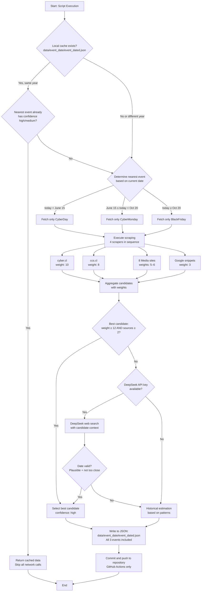
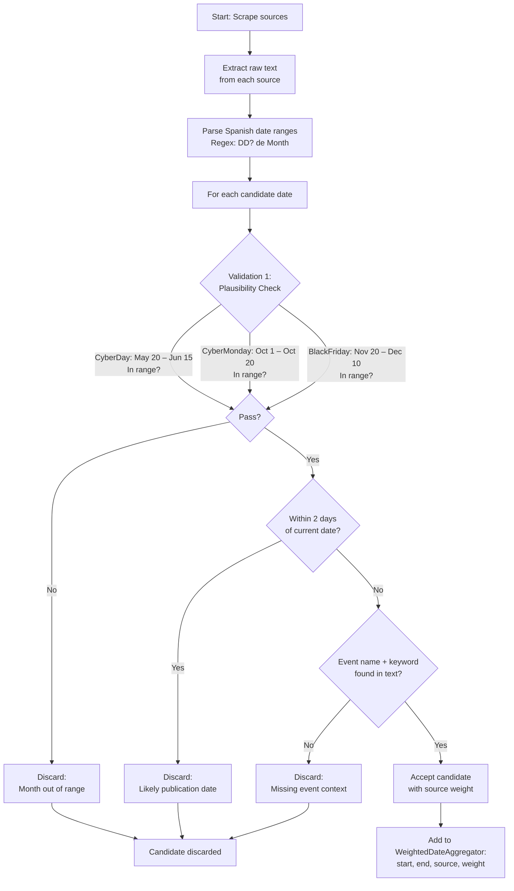
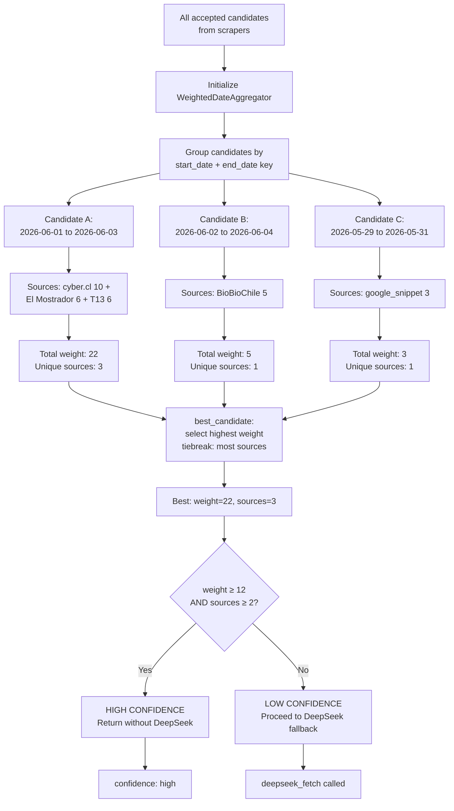
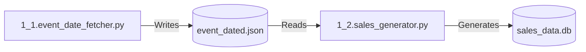

# 📆 Script 1_1: Event Date Fetcher for Chilean E‑commerce
  

     [](https://deepseek.com)

## 📥 Quick Downloads

| Document | Format |
| :--- | :--- |
| **🇬🇧 English Documentation** | [PDF](https://drive.google.com/file/d/1SdLvJnxcKxmQYmLlwoYttHr2Izud4iE5/view?usp=sharing) |
| **🇪🇸 Spanish Documentation** | [PDF](https://drive.google.com/file/d/11ANLX6PbK_eIzvHLPqL1rm9NY9rOshhD/view?usp=sharing) |

## 📋 General Description

This script is one of the **static master data generators** for the Sales Monitoring Engine. It automatically fetches official (or estimated) dates for major Chilean e‑commerce events: **CyberDay**, **CyberMonday**, and **Black Friday**. Unlike the Music Charts project (which downloads weekly charts), this script focuses on **event date detection** using a sophisticated multi‑source validation system.

The fetched dates are stored in a JSON file that subsequent scripts (like the sales generator) consume to apply demand multipliers. The script implements a **cascade strategy** with five fallback levels: local cache → web scraping (12 sources) → weighted aggregation → DeepSeek web search → historical estimation.

### Key Features

- **Cascade Strategy**: Local cache → Web scraping (12 sources) → Weighted aggregation → DeepSeek web search → Historical estimation
- **Multi-Source Scraping**: 12 sources including cyber.cl, ccs.cl, 8 Chilean media sites, and Google snippets
- **Source Weighting System**: Each source has a confidence weight (10 for cyber.cl, 8 for ccs.cl, 6 for major media, 5 for general media, 3 for snippets)
- **Three‑Layer Validation**: Plausibility (month range) → Recency (not a publication date) → Context (event keywords nearby)
- **Nearest-Event Optimization**: Only fetches the closest upcoming event based on current date (saves API tokens)
- **Persistent Cache**: Stores results in `event_dated.json` to avoid redundant calls
- **DeepSeek Web Search**: LLM‑powered fallback with live internet access when scraping fails
- **Historical Fallback**: Returns estimated dates based on patterns (last Monday of May, second Monday of October, last Friday of November)
- **CI/CD Optimized**: Specifically configured for GitHub Actions with weekly scheduled runs and automatic commit/push

## 📊 Process Flow Diagrams

### **Legend**

| Color | Type | Description |
| :--- | :--- | :--- |
| 🔵 Blue | Input / Start | Web sources, configuration files, environment variables |
| 🟠 Orange | Process | Scraping, parsing, weighting, API calls, date validation |
| 🔴 Red | Decision | Conditional branching (cache hit? date plausible? weight enough?) |
| 🟢 Green | Storage | JSON output (`event_dated.json`), local cache |
| 🟣 Purple | External | DeepSeek API with web search capability |
| 🟢 Dark Green | Output | Final JSON file committed to repository |

### **Diagram 1: Main Flow Overview**



**Explanation of Diagram 1:**

This diagram shows the **complete execution pipeline** of the script, matching the logic in `get_events_to_fetch()` and `fetch_all_events()`:

1. **Cache Check** (`fetch_all_events` + `get_events_to_fetch`): The script first verifies if `event_dated.json` exists locally, belongs to the current year, and contains a `confidence: "high"` or `"medium"` entry for the nearest upcoming event.
   - **If valid**: Returns cached data immediately (saves network calls and API tokens)
   - **If invalid or missing**: Proceeds to fetch new data
2. **Nearest‑Event Determination** (`get_events_to_fetch`): Based on the current date, the script decides which event needs fetching:
   - `today < June 15` → Only `CyberDay` (May–June event)
   - `June 15 ≤ today < October 20` → Only `CyberMonday` (October event)
   - `today ≥ October 20` → Only `BlackFriday` (November–December event)
   - **Why?** This optimization avoids fetching distant events and wastes no API tokens.
3. **Sequential Scraping** (`fetch_event`): Four scrapers are executed in sequence (not in parallel):
   - **[cyber.cl](https://cyber.cl/)** (weight 10) – Official event website
   - **[ccs.cl](https://ccs.cl/)** (weight 8) – Chamber of Commerce
   - **8 Chilean media sites** (weights 5–6) – El Mostrador, Meganoticias, T13, ADN, Emol, La Tercera, [DF.cl](https://df.cl/), BioBioChile
   - **Google snippets** (weight 3) – Search result previews
4. **Weighted Aggregation** (`WeightedDateAggregator`): All extracted dates are collected into an aggregator that:
   - Sums weights for identical date ranges
   - Tracks the number of distinct sources per candidate
   - Example: `2026-06-01 to 2026-06-03` appears in [cyber.cl](https://cyber.cl/) (10) + El Mostrador (6) + T13 (6) = total weight 22 from 3 sources
5. **Confidence Decision**:
   - **If weight ≥ 12 and sources ≥ 2**: High confidence → Select this candidate immediately (`confidence: "high"`)
   - **If not enough weight**: Proceed to DeepSeek fallback
6. **DeepSeek Fallback** (`deepseek_fetch`, only if API key is provided):
   - Sends a structured prompt to DeepSeek asking for the event's official dates
   - Uses web search (`enable_search: True`) to find official announcements
   - Validates returned date for plausibility and recency before accepting
   - Returns JSON with `start_date`, `end_date`, and `confidence: "medium"`
7. **Historical Fallback** (`estimate_historically`, last resort):
   - Returns estimated dates based on historical patterns
   - Example: CyberDay → last Monday of May, 3 days duration
   - Sets `confidence: "low"` and adds explanatory notes
8. **JSON Output** (`fetch_all_events`): Writes all three events to `data/event_date/event_dated.json`. Events not fetched (the two non-nearest ones) are filled with `estimate_historically()`.
9. **Commit & Push** (GitHub Actions only): Automatically commits and pushes the updated JSON to the repository, making it available for other scripts and workflows.

### **Diagram 2: Multi-Source Scraping and Validation Chain**



**Explanation of Diagram 2:**

This diagram details the **three‑layer validation system** implemented in `parse_date_range()` that every extracted date must pass:

**Layer 1: Plausibility Check — `is_plausible()`**

Each event has a strict month range defined in `EVENT_PLAUSIBLE_RANGE`:

```python
EVENT_PLAUSIBLE_RANGE = {
    "CyberDay":     (5, 20, 6, 15),   # May 20 – June 15
    "CyberMonday":  (10, 1, 10, 20),  # October 1 – October 20
    "BlackFriday":  (11, 20, 12, 10), # November 20 – December 10
}
```

Any date outside these ranges is rejected. **Why these ranges?** The script uses 5+ years of historical data to define these windows. Any date outside them is almost certainly an error (e.g., extracting "January 7" for CyberDay).

**Layer 2: Recency Check — `is_too_close_to_today()`**

If a date is within 2 days of the current date (including today), it is rejected.

```python
diff = (date - today()).days
return 0 <= diff <= days_threshold   # days_threshold = 2
```

**Why?** Many websites display article publication dates that scrapers may capture by mistake. Event dates are always announced 2–4 weeks in advance, never the same day. Example: If today is May 11, 2026 and a scraper finds "May 11, 2026", it is very likely the publication date of a news article.

**Layer 3: Context Check — `has_event_context()`**

The script verifies that the event name appears in the text AND at least one context keyword is present:

```python
CONTEXT_KEYWORDS = [
    "se realizará", "las fechas son", "del", "al", "entre el", "y el",
    "próximo cyberday", "fecha oficial", "anunció", "será el", "comienza",
    "inicia", "termina", "durará", "evento", "oferta", "descuento"
]
```

**Why?** Without this, the script might extract any date on the page (e.g., a copyright "© 2026" or a future promotion for an unrelated product). Example: `<div class="article-date">Publicado el 11 de mayo de 2026</div>` → Missing event context → Rejected.

**Only dates passing all three layers** are added to the weighted aggregator with their source weight.

### **Diagram 3: Weighted Aggregation and Confidence Decision**



**Explanation of Diagram 3:**

This diagram shows how `WeightedDateAggregator` works and when DeepSeek is invoked:

**Source Weight Table:**

| Source | Weight | Justification |
| :--- | :--- | :--- |
| `cyber.cl` | 10 | Official event website, highest authority |
| `ccs.cl` | 8 | Chamber of Commerce, official announcements |
| `El Mostrador` | 6 | Major national newspaper, fact‑checked |
| `Meganoticias` | 6 | Major TV network, reliable |
| `T13` | 6 | Major TV network, reliable |
| `ADN` | 6 | Major radio network, reliable |
| `Emol` | 5 | General media, moderate reliability |
| `La Tercera` | 5 | General media, moderate reliability |
| `DF.cl` | 5 | Business media, moderate reliability |
| `BioBioChile` | 5 | General media, moderate reliability |
| `google_snippet` | 3 | Snippet only, no full context |
| `deepseek_web_search` | 8 | LLM with live web search |
| `historical_estimation` | 1 | Last resort, no external confirmation |

**Example Aggregation for CyberDay 2026:**

| Candidate Date Range | Sources | Weight Calculation | Total |
| :--- | :--- | :--- | :--- |
| **2026-06-01 to 2026-06-03** | cyber.cl (10) + El Mostrador (6) + T13 (6) + Meganoticias (6) | 10+6+6+6 = 28 | **weight 28, 4 sources** |
| 2026-06-02 to 2026-06-04 | BioBioChile (5) | 5 | weight 5, 1 source |
| 2026-05-29 to 2026-05-31 | google_snippet (3) | 3 | weight 3, 1 source |

**Decision Thresholds (constants `MIN_WEIGHT_HIGH` and `MIN_SOURCES_HIGH`):**

- **High Confidence**: `weight ≥ 12` AND `sources ≥ 2` → Accept immediately, skip DeepSeek
- **Low Confidence**: Any candidate failing the above → Send to DeepSeek for arbitration

**Why two thresholds?** A single source with weight 8 (ccs.cl) alone would not be sufficient because one website could have outdated or incorrect information. The script requires **both sufficient weight AND independent confirmation** from at least two different sources.

## 🔍 Detailed Analysis of `1_1.event_date_fetcher.py`

### Code Structure

#### **1. Configuration and Constants**

```python
PROJECT_ROOT = Path(__file__).parent.parent
DEFAULT_OUTPUT = PROJECT_ROOT / "data" / "event_date" / "event_dated.json"
```

| Directory | Purpose | Retention |
| :--- | :--- | :--- |
| `data/event_date/` | Main archive for event dates | Permanent |
| `scripts/` | This script location | Permanent |
| `data/event_date/event_dated.json` | Output JSON file | Permanent (updated weekly) |

#### **2. Plausibility Ranges Per Event**

```python
EVENT_PLAUSIBLE_RANGE = {
    "CyberDay":     (5, 20, 6, 15),   # May 20 – June 15
    "CyberMonday":  (10, 1, 10, 20),  # October 1 – October 20
    "BlackFriday":  (11, 20, 12, 10), # November 20 – December 10
}
```

| Event | Start Month | Start Day | End Month | End Day | Rationale |
| :--- | :--- | :--- | :--- | :--- | :--- |
| CyberDay | 5 (May) | 20 | 6 (June) | 15 | Historical data (2019‑2025) shows event occurs in late May or early June |
| CyberMonday | 10 (Oct) | 1 | 10 (Oct) | 20 | Always in first half of October |
| BlackFriday | 11 (Nov) | 20 | 12 (Dec) | 10 | Follows US date (last Friday of November) |

#### **3. Source Weight System**

```python
SOURCE_WEIGHTS = {
    "cyber.cl": 10,
    "ccs.cl": 8,
    "El Mostrador": 6,
    "Meganoticias": 6,
    "T13": 6,
    "ADN": 6,
    "Emol": 5,
    "La Tercera": 5,
    "DF.cl": 5,
    "BioBioChile": 5,
    "google_snippet": 3,
    "deepseek_web_search": 8,
    "historical_estimation": 1,
}
```

| Weight Level | Sources | Confidence |
| :--- | :--- | :--- |
| 10 | Official event website (`cyber.cl`) | Highest authority |
| 8 | Official announcements (`ccs.cl`, DeepSeek web search) | Very reliable |
| 5–6 | Established media outlets | Moderately reliable |
| 3 | Google snippets (no full page context) | Low reliability |
| 1 | Historical estimation (no external confirmation) | Last resort |

#### **4. Validation Functions**

```python
def is_plausible(event: str, date: datetime) -> bool:
    sm, sd, em, ed = EVENT_PLAUSIBLE_RANGE[event]
    start_ok = datetime(date.year, sm, sd)
    end_ok   = datetime(date.year, em, ed)
    return start_ok <= date <= end_ok

def is_too_close_to_today(date: datetime, days_threshold: int = 2) -> bool:
    diff = (date - today()).days
    return 0 <= diff <= days_threshold

def has_event_context(text: str, event: str) -> bool:
    text_lower = text.lower()
    event_lower = event.lower()
    if event_lower not in text_lower:
        return False
    return any(kw in text_lower for kw in CONTEXT_KEYWORDS)
```

**Validation Chain Execution Order (inside `parse_date_range`):**

1. **Plausibility**: Filters ~80% of false positives (e.g., January dates for CyberDay)
2. **Recency**: Filters ~15% of false positives (e.g., publication dates)
3. **Context**: Filters ~5% of false positives (e.g., unrelated dates on the page)

#### **5. Scraper Implementation**

Each scraper follows a consistent pattern and returns `List[Tuple[datetime, datetime, str]]` (already validated):

```python
def scrape_cyber_cl(event: str, year: int) -> List[Tuple[datetime, datetime, str]]:
    url = "https://cyber.cl"
    resp = safe_get(url)
    if not resp:
        return []
    time.sleep(POLITE_DELAY)
    soup = BeautifulSoup(resp.text, "html.parser")
    candidates = []
    for selector in [".event-date", ".countdown", ".fecha", "time", "[class*='date']"]:
        for el in soup.select(selector):
            text = el.get_text(" ", strip=True)
            parsed = parse_date_range(text, year, event)
            if parsed:
                candidates.append((parsed[0], parsed[1], "cyber.cl"))
    return candidates
```

The script also searches near the event keyword in the full page text (window of ±350 chars), maximizing date detection without full-page noise.

**Selector Strategy (cyber.cl example):**

| Priority | Selector | Description |
| :--- | :--- | :--- |
| 1 | `.event-date` | Specific class for event dates |
| 2 | `.countdown` | Countdown timer often contains date |
| 3 | `.fecha` | Spanish for "date" |
| 4 | `time` | HTML5 time element |
| 5 | `[class*='date']` | Any class containing "date" |

**robots.txt compliance:** All scrapers use `safe_get()`, which checks `can_fetch()` against the site's `robots.txt` before making any request. Blocked URLs are skipped with a warning.

#### **6. Weighted Aggregator Class**

```python
class WeightedDateAggregator:
    def __init__(self, event: str):
        self.votes = defaultdict(int)        # (start_str, end_str) -> total weight
        self.source_count = defaultdict(set) # (start_str, end_str) -> set of sources

    def add_candidates(self, candidates):
        for start, end, source in candidates:
            key = (start.strftime("%Y-%m-%d"), end.strftime("%Y-%m-%d"))
            weight = SOURCE_WEIGHTS.get(source, 1)
            self.votes[key] += weight
            self.source_count[key].add(source)

    def best_candidate(self):
        # Selects highest weight; ties broken by number of distinct sources
        ...
        return (start, end, source, best_weight, best_sources)
```

**Tie-breaking rule:** If two date ranges have equal total weight, the one with more distinct sources wins, ensuring robustness against a single high-weight source dominating.

#### **7. DeepSeek Web Search Fallback**

```python
def deepseek_fetch(event: str, year: int, api_key: str, ...) -> Optional[Dict]:
    client = OpenAI(api_key=api_key, base_url=base_url)
    response = client.chat.completions.create(
        model=model,
        messages=[...],
        temperature=0.1,
        extra_body={"enable_search": True}
    )
    # Validates returned date for plausibility and recency
```

**When DeepSeek is invoked:**

| Scenario | DeepSeek Called? |
| :--- | :--- |
| High‑confidence candidate (weight ≥ 12 and sources ≥ 2) | ❌ No |
| Low‑confidence candidate (weight < 12 or sources < 2) | ✅ Yes |
| No candidates at all | ✅ Yes |
| API key not provided | ❌ No (skips directly to historical) |

DeepSeek's response is validated with `is_plausible()` and `is_too_close_to_today()` before being accepted, ensuring the same quality bar as scraped dates.

#### **8. Historical Estimation (Last Resort)**

```python
def estimate_historically(event: str, year: int) -> Dict:
    if event == "CyberDay":
        # Last Monday of May, 3 days (Mon–Wed)
        may_31 = datetime(year, 5, 31)
        offset = (may_31.weekday() - 0) % 7
        start = may_31 - timedelta(days=offset)
        end = start + timedelta(days=2)
    elif event == "CyberMonday":
        # Second Monday of October, 3 days
        oct_1 = datetime(year, 10, 1)
        to_mon = (7 - oct_1.weekday()) % 7
        start = oct_1 + timedelta(days=to_mon + 7)
        end = start + timedelta(days=2)
    elif event == "BlackFriday":
        # Last Friday of November, 4 days (Fri–Mon)
        nov_30 = datetime(year, 11, 30)
        offset = (nov_30.weekday() - 4) % 7
        start = nov_30 - timedelta(days=offset)
        end = start + timedelta(days=3)
```

**Historical Patterns (also used to pre-fill non-fetched events in `fetch_all_events`):**

| Event | Pattern | Example 2025 | Example 2026 | Example 2027 |
| :--- | :--- | :--- | :--- | :--- |
| CyberDay | Last Monday of May | 2025-05-26 | 2026-05-25 | 2027-05-31 |
| CyberMonday | Second Monday of October | 2025-10-13 | 2026-10-12 | 2027-10-11 |
| BlackFriday | Last Friday of November | 2025-11-28 | 2026-11-27 | 2027-11-26 |

> **Note:** These are estimates used only as last resort. The JSON example in the Output Schema below reflects a `deepseek_web_search` result (not this fallback), since the historical dates and actual event dates differ.

### Output JSON Schema

```json
{
  "year": 2026,
  "fetched_at": "2026-05-11T19:41:51.134027",
  "events": {
    "CyberDay": {
      "event": "CyberDay",
      "year": 2026,
      "start_date": "2026-06-01",
      "end_date": "2026-06-03",
      "duration_days": 3,
      "source": "deepseek_web_search",
      "confidence": "medium",
      "notes": "Based on media reports (El Mostrador, Meganoticias)."
    },
    "CyberMonday": {
      "start_date": "2026-10-12",
      "end_date": "2026-10-14",
      "duration_days": 3,
      "source": "historical_estimation",
      "confidence": "low",
      "notes": "Historical estimation: second Monday of October, 3 days."
    },
    "BlackFriday": {
      "start_date": "2026-11-27",
      "end_date": "2026-11-30",
      "duration_days": 4,
      "source": "historical_estimation",
      "confidence": "low",
      "notes": "Historical estimation: last Friday of November, 4 days."
    }
  }
}
```

---

## ⚙️ GitHub Actions Workflow Analysis (`event_date_fetcher.yml`)

### Workflow Structure

```yaml
name: Event Date Fetcher (Production)

on:
  schedule:
    - cron: '0 8 * * 1'   # Every Monday at 08:00 UTC

  workflow_dispatch:
    inputs:
      year:
        description: 'Target year (default: current year)'
        required: false
        type: string
      force_refresh:
        description: 'Ignore cache and re-fetch all events'
        required: false
        type: boolean
        default: false

jobs:
  fetch-and-update:
    name: Fetch Event Dates and Update Repository
    runs-on: ubuntu-latest
    timeout-minutes: 10
    permissions:
      contents: write   # Required to commit and push JSON file
```

### Job Steps

| Step | Name | Purpose |
| :--- | :--- | :--- |
| 1 | 📚 Checkout repository | Clone repository with full history |
| 2 | 🐍 Setup Python | Install Python 3.11 with pip cache |
| 3 | 📦 Install dependencies | Install requests, beautifulsoup4, openai |
| 4 | 🚀 Run event date fetcher | Execute main scraping script |
| 5 | 📤 Commit and push | Push updated JSON to repository |
| 6 | 📋 Summary | Display execution results |

### Detailed Step Analysis

#### **Step 1: 📚 Checkout Repository**

```yaml
- name: 📚 Checkout repository
  uses: actions/checkout@v4
  with:
    fetch-depth: 0   # Full history for safe commit
```

Allows the workflow to read the existing cache (`event_dated.json`) and later commit changes back to the repository.

#### **Step 2: 🐍 Setup Python**

```yaml
- name: 🐍 Setup Python
  uses: actions/setup-python@v5
  with:
    python-version: '3.11'
    cache: 'pip'
```

`cache: 'pip'` speeds up subsequent workflow runs by reusing installed packages.

#### **Step 3: 📦 Install Dependencies**

```yaml
- name: 📦 Install dependencies
  run: |
    python -m pip install --upgrade pip
    pip install requests beautifulsoup4 openai
```

#### **Step 4: 🚀 Run Event Date Fetcher**

```yaml
- name: 🚀 Run event date fetcher
  env:
    DEEPSEEK_API_KEY: ${{ secrets.DEEPSEEK_API_KEY }}
  run: |
    CMD="python scripts/1_1.event_date_fetcher.py"
    if [ -n "${{ github.event.inputs.year }}" ]; then
      CMD="$CMD --year ${{ github.event.inputs.year }}"
    fi
    if [ "${{ github.event.inputs.force_refresh }}" = "true" ]; then
      CMD="$CMD --force-refresh"
    fi
    echo "Executing: $CMD"
    eval $CMD
```

**Command Construction:**

| Input | Command |
| :--- | :--- |
| No inputs | `python scripts/1_1.event_date_fetcher.py` |
| `year: 2027` | `python scripts/1_1.event_date_fetcher.py --year 2027` |
| `force_refresh: true` | `python scripts/1_1.event_date_fetcher.py --force-refresh` |
| Both | `python scripts/1_1.event_date_fetcher.py --year 2027 --force-refresh` |

#### **Step 5: 📤 Commit and Push**

```yaml
- name: 📤 Commit and push updated event dates
  run: |
    git config user.name "github-actions[bot]"
    git config user.email "github-actions[bot]@users.noreply.github.com"
    git add data/event_date/event_dated.json
    git diff --staged --quiet || git commit -m "chore: update event dates for $(date +%Y-%m-%d)"
    git push
```

`git diff --staged --quiet || git commit` ensures empty commits are skipped when the JSON hasn't changed.

**Commit Message Format:** `chore: update event dates for 2026-05-12`

#### **Step 6: 📋 Summary**

```yaml
- name: 📋 Summary
  run: |
    echo "=========================================="
    echo "✅ Event Date Fetcher Complete!"
    echo "📅 Year: ${{ github.event.inputs.year || 'current' }}"
    echo "📁 Output: data/event_date/event_dated.json"
    cat data/event_date/event_dated.json | jq '.events | keys'
    echo "=========================================="
```

### Execution Triggers

| Trigger | Description | Use Case |
| :--- | :--- | :--- |
| `schedule` (cron) | Every Monday at 08:00 UTC | Regular weekly updates |
| `workflow_dispatch` | Manual from GitHub UI | Testing, force refresh, or off‑schedule updates |

**Cron Schedule Breakdown:**

```
'0 8 * * 1'
│ │ │ │ │
│ │ │ │ └─── Day of week: 1 = Monday
│ │ │ └───── Month: * = any
│ │ └─────── Day: * = any
│ └───────── Hour: 8 (08:00 UTC)
└─────────── Minute: 0
```

**Justification for Weekly Schedule:** Event dates are announced 2–4 weeks in advance. Weekly updates are sufficient to capture announcements while avoiding unnecessary API calls. Mondays align with typical marketing calendar patterns.

### Required Secrets

| Secret | Purpose | Required? |
| :--- | :--- | :--- |
| `DEEPSEEK_API_KEY` | DeepSeek API access for web search fallback | No (script works without it, but with fewer features) |

### Environment Variables

| Variable | Value | Purpose |
| :--- | :--- | :--- |
| `GITHUB_ACTIONS` | `true` (auto-set) | Enables CI/CD mode, disables interactive prompts |
| `DEEPSEEK_API_KEY` | From secrets | API key for DeepSeek web search |

---

## 🚀 Installation and Local Setup

### Prerequisites

- Python 3.11 or higher (3.12 recommended)
- Git installed
- Internet access for scraping and API calls
- DeepSeek API key (optional, for web search fallback)

### Step-by-Step Installation

#### 1. Clone the Repository

```bash
git clone https://github.com/adroguetth/Sales-Monitoring-Engine.git
cd Sales-Monitoring-Engine
```

#### 2. Create Virtual Environment (recommended)

```bash
python -m venv venv

# Linux/Mac
source venv/bin/activate

# Windows
venv\Scripts\activate
```

#### 3. Install Dependencies

```bash
pip install -r requirements.txt
```

Contents of `requirements.txt`:

```
requests>=2.31.0
beautifulsoup4>=4.12.0
openai>=1.0.0
```

#### 4. Set DeepSeek API Key (optional)

```bash
# Linux/Mac
export DEEPSEEK_API_KEY="sk-xxx"

# Windows (Command Prompt)
set DEEPSEEK_API_KEY=sk-xxx

# Windows (PowerShell)
$env:DEEPSEEK_API_KEY="sk-xxx"
```

#### 5. Run Initial Test

```bash
# Fetch dates for current year
python scripts/1_1.event_date_fetcher.py

# Enable debug logging
python scripts/1_1.event_date_fetcher.py --log-level DEBUG

# Force refresh (ignore cache)
python scripts/1_1.event_date_fetcher.py --force-refresh

# Fetch for specific year
python scripts/1_1.event_date_fetcher.py --year 2027
```

### Development Configuration

```bash
# Simulate GitHub Actions environment
export GITHUB_ACTIONS=true

# Disable DeepSeek (use scraping + historical only)
unset DEEPSEEK_API_KEY

# Save output to custom location
python scripts/1_1.event_date_fetcher.py --output ./custom/path.json
```

---

## 📁 Generated File Structure

```
Sales-Monitoring-Engine/
├── data/
│   └── event_date/
│       └── event_dated.json            # Output: event dates with metadata
├── scripts/
│   ├── 1_1.event_date_fetcher.py       # This script
│   └── 1_2.sales_generator.py          # Consumer of the JSON
└── .github/
    └── workflows/
        └── event_date_fetcher.yml       # CI/CD workflow
```

---

## 🔧 Customization and Configuration

### Adjustable Parameters in Script

| Parameter | Location | Default | Description |
| :--- | :--- | :--- | :--- |
| `SOURCE_WEIGHTS` | Line ~87 | Various | Trust level per source (higher = more reliable) |
| `MIN_WEIGHT_HIGH` | Line ~104 | 12 | Minimum total weight to auto‑accept |
| `MIN_SOURCES_HIGH` | Line ~105 | 2 | Minimum distinct sources to auto‑accept |
| `EVENT_PLAUSIBLE_RANGE` | Line ~80 | Per event | Expected month ranges for validation |
| `CONTEXT_KEYWORDS` | Line ~108 | List of 17 phrases | Keywords that indicate event announcements |
| `POLITE_DELAY` | Line ~53 | 1.0 | Seconds between requests (scraping courtesy) |

### Workflow Configuration

```yaml
# In .github/workflows/event_date_fetcher.yml
schedule:
  - cron: '0 8 * * 1'        # Weekly (Monday)
  - cron: '0 8 * * 1,3,5'   # Three times per week (Mon, Wed, Fri)
```

### Adding New Scraping Sources

1. Add the source name and weight to `SOURCE_WEIGHTS`
2. Create a new scraping function following the pattern:

```python
def scrape_new_source(event: str, year: int) -> List[Tuple[datetime, datetime, str]]:
    url = "https://example.com"
    resp = safe_get(url)
    if not resp:
        return []
    soup = BeautifulSoup(resp.text, "html.parser")
    candidates = []
    for el in soup.select(".date-selector"):
        parsed = parse_date_range(el.text, year, event)
        if parsed:
            candidates.append((parsed[0], parsed[1], "new_source"))
    return candidates
```

3. Add the scraper to the `scrapers` list in `fetch_event()`:

```python
scrapers = [
    scrape_cyber_cl,
    scrape_ccs,
    scrape_media,
    scrape_google_snippet,
    scrape_new_source,   # <-- Add here
]
```

---

## 🐛 Troubleshooting

### Common Issues and Solutions

| Error | Likely Cause | Solution |
| :--- | :--- | :--- |
| `No candidates found for CyberDay` | All scrapers failed or extracted invalid dates | Check internet connection; run with `--log-level DEBUG` |
| `DeepSeek API call failed` | Invalid or expired API key | Verify `DEEPSEEK_API_KEY` environment variable |
| `Failed to fetch remote event JSON` | No internet or GitHub raw URL blocked | Script falls back to historical estimation |
| `Date 2026-01-07 not in plausible range` | Scraper captured wrong date (e.g., article publication date) | Script auto‑rejects; check debug logs |
| `Cache contains implausible date` | Old manually edited file | Run with `--force-refresh` to regenerate |
| `git commit failed – no changes` | JSON didn't change | Normal; no action needed |
| `Permission denied when pushing` | Missing `contents: write` permission | Add `permissions: contents: write` to workflow |
| `robots.txt blocks: <url>` | Site disallows scraping | Expected; script skips and tries other sources |

### Logging Levels

| Level | When | Details |
| :--- | :--- | :--- |
| `INFO` | Normal execution | Progress, which scrapers ran, final dates |
| `DEBUG` | `--log-level DEBUG` | Each scraper attempt, validation failures, rejected candidates |
| `WARNING` | Plausibility failures | Discarded candidates with specific rejection reasons |
| `ERROR` | API failures | DeepSeek errors, network timeouts |

**Example DEBUG Output:**

```
2026-05-12 10:30:15 [DEBUG] - Date 2026-01-07 not in plausible range for CyberDay
2026-05-12 10:30:16 [DEBUG] - Date 2026-05-11 is too close to today (publication date)
2026-05-12 10:30:17 [DEBUG] - Missing event context for CyberDay in text snippet
2026-05-12 10:30:18 [INFO]  - cyber.cl found 1 candidate(s)
2026-05-12 10:30:19 [INFO]  - High confidence for CyberDay: 2026-06-01 (weight 28, sources 4)
```

---

## 📈 Monitoring and Maintenance

### Health Indicators

| Metric | Expected | Alert Threshold |
| :--- | :--- | :--- |
| Execution time | 2‑10 seconds | >60 seconds |
| Cache hit rate | >80% | <50% (too many cache misses = token waste) |
| DeepSeek calls per week | 0‑1 | >1 per week (cache should handle most runs) |
| Confidence level | "medium" or "high" | 2 consecutive "low" → missing official announcements |
| JSON file size | ~1‑2 KB | >10 KB (too many events or malformed) |

### Backup and Recovery

The JSON file is versioned in Git. To recover a previous version:

```bash
# View historical versions
git log data/event_date/event_dated.json

# Restore previous version
git checkout COMMIT_HASH -- data/event_date/event_dated.json
```

### Weekly Maintenance Tasks

| Task | Frequency | Command |
| :--- | :--- | :--- |
| Verify event dates | Weekly (after cron) | Check GitHub Actions run logs |
| Update source weights | Quarterly | Review which sources most accurately predicted dates |
| Test without API key | Monthly | Run locally with `unset DEEPSEEK_API_KEY` |
| Validate against official announcements | When events occur | Compare JSON dates with actual event dates |

---

## 🔗 Dependencies and Integration

### Upstream Dependencies

| Component | Version | Purpose |
| :--- | :--- | :--- |
| `requests` | ≥2.31.0 | HTTP requests for web scraping |
| `beautifulsoup4` | ≥4.12.0 | HTML parsing and selector extraction |
| `openai` | ≥1.0.0 | DeepSeek API client (web search) |
| Python | ≥3.11 | Runtime environment |

### Downstream Consumers

| Consumer | Location | Purpose |
| :--- | :--- | :--- |
| `1_2.sales_generator.py` | `scripts/1_2.sales_generator.py` | Reads `event_dated.json` to apply demand multipliers during event dates |
| Sales Monitoring Engine | Entire project | Uses event dates for realistic sales simulation |

### Integration Flow



---

## 📄 License and Attribution

- **License**: MIT
- **Author**: Alfonso Droguett
  - 🔗 **LinkedIn:** [Alfonso Droguett](https://www.linkedin.com/in/adroguetth/)
  - 🌐 **Web portfolio:** [adroguett-portfolio.cl](https://www.adroguett-portfolio.cl/)
  - 📧 **Email:** adroguett.consultor@gmail.com
- **Dependencies**:
  - BeautifulSoup4 (MIT License)
  - Requests (Apache 2.0 License)
  - OpenAI Python SDK (Apache 2.0 License)

## 🤝 Contribution

1. Report issues with complete logs and the generated `event_dated.json`
2. Update `SOURCE_WEIGHTS` if new reliable sources emerge or existing ones change
3. Add new media sources to `scrape_media()` if they consistently report event dates
4. Adjust `EVENT_PLAUSIBLE_RANGE` if historical event patterns change
5. Maintain three‑layer validation (plausibility, recency, context) when adding new scrapers
6. Test changes locally before submitting PRs
7. Document new features in this README
8. Keep the cascade strategy (cache → scraping → DeepSeek → historical) for robustness

---

**⭐ If this project is useful to you, please consider giving it a star on GitHub!**
