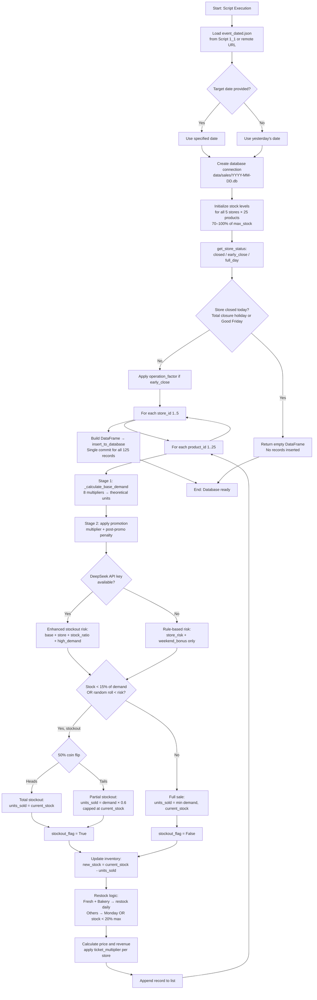
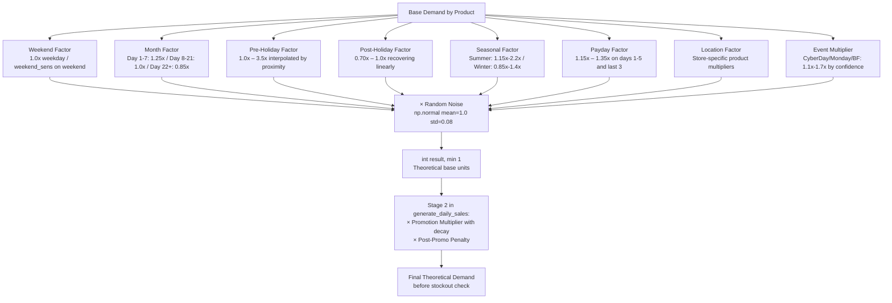
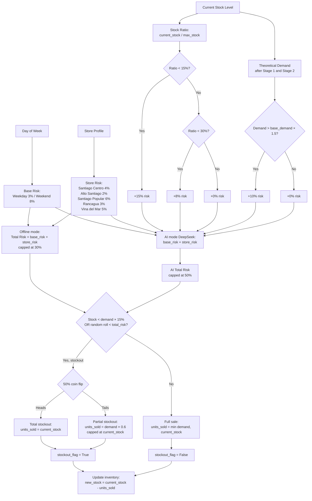
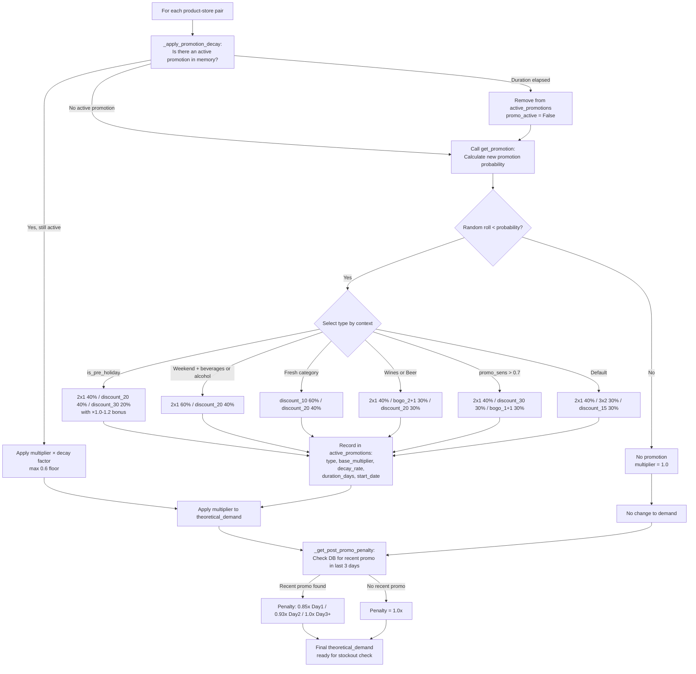
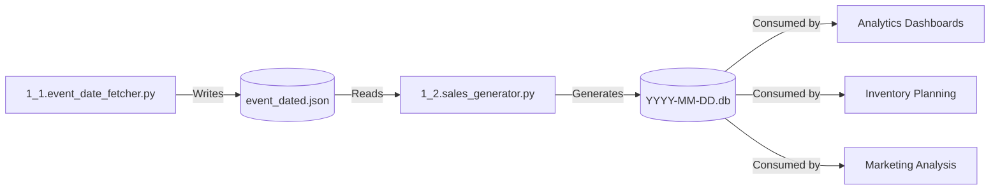

#  🛍️ Script 1_2: Sales Data Generator for Retail Analytics

  

    [](https://deepseek.com)

## 📥 Quick Downloads

| Document                     | Format                                                       |
| :--------------------------- | :----------------------------------------------------------- |
| **🇬🇧 English Documentation** | [PDF](https://drive.google.com/file/d/1SdLvJnxcKxmQYmLlwoYttHr2Izud4iE5/view?usp=sharing) |
| **🇪🇸 Spanish Documentation** | [PDF](https://drive.google.com/file/d/11ANLX6PbK_eIzvHLPqL1rm9NY9rOshhD/view?usp=sharing) |

## 📋 General Description

This script is the **third component** of the Sales Monitoring Engine intelligence system. It generates realistic daily sales data for a retail company with 5 stores and 25 products. Unlike simple random generators, this script simulates **realistic demand patterns** including seasonality, holidays, promotions, stockouts, and e‑commerce events (CyberDay, CyberMonday, Black Friday).

The script consumes the `event_dated.json` file generated by Script 1_1 to apply demand multipliers during official event dates. It outputs a versioned SQLite database (`data/sales/YYYY-MM-DD.db`) with complete sales transaction data, including all the factors that influenced demand (weekend factor, holiday factor, promotion multiplier, event multiplier, etc.).

### Key Features

- **25 Products**: Distributed across 6 categories (grocery, dairy, bakery, fresh, beverages, alcohol, cleaning)
- **5 Stores**: Different profiles (urban center, premium, popular, regional, coastal)
- **Realistic Demand Simulation**: 10 different multipliers applied in two stages to generate realistic sales
- **Event Date Integration**: Reads `event_dated.json` from Script 1_1 for CyberDay, CyberMonday, Black Friday multipliers
- **9 Types of Promotions**: 2x1, 3x2, BOGO variants (1+1, 2+1, 3+2), percentage discounts (10%, 15%, 20%, 30%)
- **Promotion Decay**: Each promotion loses effectiveness by 10-15% per day
- **Post-Promotion Penalty**: 15% demand drop for 2-3 days after a promotion ends
- **Stockout Simulation**: Based on inventory levels, day of week, and store profile
- **Monday Restock**: Automatic inventory replenishment every Monday (or below 20% threshold); fresh products and bakery restock daily
- **Holiday Effects**: Pre‑holiday demand spikes, post‑holiday demand drops
- **Seasonality**: Summer/Winter demand changes (fruits +35% in summer, beer +60%, yerba mate +40% in winter)
- **Payday Spikes**: +15-35% demand on first 5 days and last 3 days of each month
- **Store Location Factors**: Each store has unique demand patterns (e.g., Vina del Mar: +120% beer in summer)
- **DeepSeek AI Integration**: Optional enhanced stockout prediction that adds stock-ratio and high-demand risk factors
- **CI/CD Optimized**: Daily automated runs via GitHub Actions with versioned database output

## 📊 Process Flow Diagrams

### **Legend**

| Color | Type | Description |
| :--- | :--- | :--- |
| 🔵 Blue | Input / Start | Product configuration, store profiles, event dates JSON |
| 🟠 Orange | Process | Demand calculation, promotion selection, stockout simulation |
| 🔴 Red | Decision | Conditional branching (promotion active? stockout risk?) |
| 🟢 Green | Storage | SQLite database (`data/sales/YYYY-MM-DD.db`) |
| 🟣 Purple | External | DeepSeek API (optional enhanced stockout prediction) |
| 🟢 Dark Green | Output | Final database ready for analysis |

### **Diagram 1: Main Flow Overview**



**Explanation of Diagram 1:**

This diagram shows the **complete daily sales generation pipeline** matching the logic in `generate_daily_sales()` and `insert_to_database()`:

1. **Load Event Dates** (`load_event_dates`): Reads `event_dated.json` from the local path first; if missing, falls back to the remote GitHub raw URL; if both fail, uses hardcoded default dates.
2. **Target Date Determination**: If no `--date` argument is given, the script generates sales for **yesterday**. This ensures the daily cron workflow always processes the previous day automatically.
3. **Store Status Check** (`get_store_status`): Before iterating products, the script checks whether the store is fully closed (total closure holidays or Good Friday), partially closed (early closure holidays or Maundy Thursday), or open for a full day. If closed, an empty DataFrame is returned and no records are inserted.
4. **Stock Initialization** (`_initialize_stocks`): Each of the 125 store-product combinations starts at 70–100% of its `max_stock` (randomized with `rng.uniform(0.7, 1.0)`).
5. **Nested Loops** (`generate_daily_sales`): The script iterates `for store_id in stores` → `for product_id in products`, generating one record per combination. All records are accumulated into a list and inserted in a **single commit** at the end — not per-store.
6. **Stage 1 — Base Demand** (`_calculate_base_demand`): Applies 8 multipliers: weekend, month, pre-holiday, post-holiday, seasonal, payday, location, and event. Random noise is also applied here.
7. **Stage 2 — Promotion** (`generate_daily_sales`): Promotion multiplier and post-promotion penalty are applied **after** base demand, in `generate_daily_sales()`, not inside `_calculate_base_demand()`.
8. **Stockout Decision**: The combined condition `if current_stock < theoretical_demand * 0.15 OR rng.random() < stockout_risk` is evaluated in a single `if` statement. If true, a 50/50 coin flip decides between total stockout (sell only what's in stock) and partial stockout (sell 60% of demand, capped at current stock).
9. **Restock Logic**: Fresh products and bakery items (`FRESH_PRODUCTS = [11, 12, 13, 14, 15, 16]`, which includes Bread and Pastries) restock daily. All other products restock every Monday or when stock falls below 20% of max.
10. **Single Commit** (`insert_to_database`): All records for the day are built into a DataFrame and inserted in one operation via `df.to_sql()` followed by a single `conn.commit()`.

### **Diagram 2: Base Demand Calculation (Stage 1 — 8 Multipliers in `_calculate_base_demand`)**



**Explanation of Diagram 2:**

The demand calculation happens in **two separate stages** across two methods:

**Stage 1 — inside `_calculate_base_demand()`:** 8 multipliers × random noise → integer result (min 1).

**Stage 2 — inside `generate_daily_sales()`:** Promotion multiplier (with daily decay) and post-promotion penalty are applied to the Stage 1 result to produce the final `theoretical_demand`.

```python
# Stage 1
demand = int(base_demand * weekend_factor * month_factor * pre_factor *
             post_factor * seasonal_factor * payday_factor *
             location_factor * event_mult * noise)

# Stage 2 (in generate_daily_sales)
theoretical_demand = int(base_demand * promo_multiplier)
theoretical_demand = int(theoretical_demand * post_penalty)
```

**1. Base Demand (per product)**

| Product Category         | Base Demand Range | Example                               |
| :----------------------- | :---------------- | :------------------------------------ |
| Bakery (Bread)           | 200               | Highest volume, daily purchase        |
| Snacks (Cookies)         | 150               | High impulse, sensitive to promotions |
| Grocery (Rice)           | 80-120            | Medium volume, stable demand          |
| Fresh (Meat, Fish)       | 45-70             | Lower volume, higher ticket           |
| Alcohol (Wines, Beer)    | 50-80             | Weekend spikes                        |

**2. Weekend Factor (per product)**

| Product        | Monday-Thursday | Friday | Saturday | Sunday |
| :------------- | :-------------- | :----- | :------- | :----- |
| Beer           | 1.0x            | 1.4x   | 2.0x     | 1.8x   |
| Meat           | 1.0x            | 1.2x   | 1.45x    | 1.4x   |
| Bread          | 1.0x            | 1.2x   | 1.4x     | 1.3x   |

**3. Month Factor**

| Period                 | Factor | Justification                        |
| :--------------------- | :----- | :----------------------------------- |
| Days 1-7               | 1.25x  | Payday + beginning of month shopping |
| Days 8-21              | 1.0x   | Normal demand                        |
| Days 22+ (to end)      | 0.85x  | End of month, lower budgets          |

**4. Pre‑Holiday Factor (Example: Fiestas Patrias)**

| Days Before | Factor for Meat | Factor for Wines |
| :---------- | :-------------- | :--------------- |
| 15 days     | 1.5x            | 1.5x             |
| 10 days     | 2.0x            | 2.0x             |
| 5 days      | 2.8x            | 2.6x             |
| 1 day       | 3.5x            | 3.2x             |

**5. Post‑Holiday Factor (Example: Fiestas Patrias)**

| Days After | Factor | Recovery         |
| :--------- | :----- | :--------------- |
| Day 1      | 0.70x  | Lowest point     |
| Day 3      | 0.80x  | Partial recovery |
| Day 5      | 0.90x  | Near normal      |
| Day 7      | 0.95x  | Almost recovered |

**6. Seasonal Factor**

| Season           | Product          | Factor                                |
| :--------------- | :--------------- | :------------------------------------ |
| Summer (Dec-Feb) | Beer             | 1.3x - 1.6x (1.8x–2.2x in Vina del Mar) |
| Summer (Dec-Feb) | Fruits, Vegetables | 1.15x - 1.35x                        |
| Summer (Dec-Feb) | Soda, Juices     | 1.2x - 1.4x                           |
| Winter (Jun-Aug) | Yerba Mate       | 1.2x - 1.4x                           |
| Winter (Jun-Aug) | Grocery          | 1.05x - 1.15x                         |
| Winter (Jun-Aug) | Vina del Mar (all) | 0.85x (winter_factor)               |

**7. Payday Factor**

| Period                        | Factor       | Stores                              |
| :---------------------------- | :----------- | :---------------------------------- |
| Days 1-5 of month             | +20% to +35% | Highest in Santiago Popular (+35%) |
| Last 3 days of month          | +20% to +35% | Highest in Santiago Popular (+35%) |
| Other days                    | 1.0x         | Normal                              |

**8. Location Factor (Store‑specific, selected products)**

| Product | Santiago Centro | Alto Santiago | Santiago Popular | Rancagua | Vina del Mar |
| :------ | :-------------- | :------------ | :--------------- | :------- | :----------- |
| Rice    | 1.0x            | 0.8x          | 1.4x             | 1.0x     | 1.0x         |
| Cheese  | 1.0x            | 1.6x          | 1.0x             | 1.0x     | 1.0x         |
| Bread   | 1.3x            | 1.0x          | 1.5x             | 1.0x     | 1.0x         |
| Beer    | 1.3x            | 1.0x          | 1.0x             | 1.0x     | 2.2x         |

**9. Event Multiplier (from Script 1_1)**

| Confidence | CyberDay    | CyberMonday | Black Friday |
| :--------- | :---------- | :---------- | :----------- |
| High       | 1.5x - 1.7x | 1.5x - 1.7x | 1.5x - 1.7x  |
| Medium     | 1.3x - 1.5x | 1.3x - 1.5x | 1.3x - 1.5x  |
| Low        | 1.1x - 1.3x | 1.1x - 1.3x | 1.1x - 1.3x  |

**10. Promotion Multiplier (with Decay — Stage 2)**

| Promotion Type | Day 1 | Day 2 | Day 3 | Day 4  | Day 5  |
| :------------- | :---- | :---- | :---- | :----- | :----- |
| 2x1            | 1.6x  | 1.36x | 1.16x | 0.98x  | (ends) |
| Discount 30%   | 2.2x  | 1.98x | 1.78x | 1.60x  | 1.44x  |
| BOGO 1+1       | 1.8x  | 1.53x | 1.30x | (ends) | (ends) |

**11. Post‑Promotion Penalty (Stage 2)**

| Days After Promotion | Penalty Factor |
| :------------------- | :------------- |
| Day 1                | 0.85x          |
| Day 2                | 0.93x          |
| Day 3+               | 1.00x          |

**12. Random Noise**

- Normal distribution: `noise = rng.normal(1.0, 0.08)`
- Range: Approximately 0.84x to 1.16x (95% confidence)
- Applied inside `_calculate_base_demand()`, before Stage 2

### **Diagram 3: Stockout Risk and Simulation**



**Explanation of Diagram 3:**

This diagram shows how the stockout decision works, with **two distinct modes** depending on whether a DeepSeek API key is available:

**Offline Mode (no API key):**

```python
store_risk = {1: 0.04, 2: 0.02, 3: 0.06, 4: 0.03, 5: 0.05}.get(store_id, 0.03)
stockout_risk = store_risk + (0.05 if is_weekend else 0)
stockout_risk = min(0.3, stockout_risk)
```

No stock-ratio or high-demand factors are applied — only base risk + store risk, capped at 30%.

**AI Mode (with DeepSeek API key):**

Uses `DeepSeekIntelligence.predict_stockout_risk()`, which adds two extra risk factors:

```python
if stock_ratio < 0.15:
    base_risk += 0.15
elif stock_ratio < 0.30:
    base_risk += 0.08
if demand > PRODUCTS[product_id][2] * 1.5:
    base_risk += 0.10
```

Total risk is capped at 50% in AI mode (vs 30% in offline mode).

**Stock ratio is calculated against `max_stock`, not against demand:**

```python
stock_ratio = current_stock / PRODUCTS[product_id][5]   # [5] = max_stock
```

**Stockout trigger — single combined condition:**

```python
if current_stock < theoretical_demand * 0.15 or rng.random() < stockout_risk:
```

Both the stock-level hard trigger and the probability roll are evaluated in the same `if` statement.

**Base Risk by Day:**

| Day             | Base Risk | Justification                            |
| :-------------- | :-------- | :--------------------------------------- |
| Monday-Thursday | 3%        | Regular replenishment, stable inventory  |
| Friday-Sunday   | 8%        | Higher traffic, less time for restocking |

**Store‑Specific Risk Modifier:**

| Store              | Risk Modifier | Justification                              |
| :----------------- | :------------ | :----------------------------------------- |
| Santiago Centro    | 4%            | High traffic, limited backroom space       |
| Alto Santiago      | 2%            | Premium store, better inventory management |
| Santiago Popular   | 6%            | High volume, fast turnover                 |
| Rancagua           | 3%            | Normal regional traffic                    |
| Vina del Mar       | 5%            | Seasonal spikes (summer tourism)           |

**Example Calculation (Santiago Popular on Saturday, AI mode, stock at 10%):**

```text
Base Risk (Weekend):              8%
Store Risk (Santiago Popular):    6%
Stock Ratio (50/500 = 10%):      +15%
High Demand (demand > 1.5×base): +10%
Total Stockout Risk:             39%  (capped at 50%)
```

### **Diagram 4: Promotion Lifecycle**



**Explanation of Diagram 4:**

This diagram shows the complete promotion lifecycle:

**Promotion Probability Calculation:**

| Factor                        | Addition | Example Date (Pre‑Holiday Saturday) |
| :---------------------------- | :------- | :---------------------------------- |
| Base                          | 5%       | +5%                                 |
| Weekend                       | +8%      | +8%                                 |
| Month-end (day ≥25)           | +5%      | +0% (if day 15)                     |
| Pre‑holiday (1-3 days before) | +10%     | +10%                                |
| Product sensitivity           | +5-9%    | +6% (for Cookies, promo_sens=0.8)   |
| Store promo bonus             | +5-12.5% | +0% (neutral store)                 |
| **Total Probability**         |          | **~29%** (capped at 35%, floor 2%)  |

**Promotion Types and Duration:**

| Promotion Type            | Duration | Decay/Day | Typical Products   |
| :------------------------ | :------- | :-------- | :----------------- |
| BOGO (1+1, 2+1, 3+2)      | 3 days   | 15%       | Soda, Cookies      |
| 2x1                       | 4 days   | 15%       | Noodles, Beer      |
| 3x2                       | 5 days   | 15%       | Rice, Oil          |
| Discount 10-20%           | 7 days   | 10%       | Meat, Vegetables   |
| Discount 30%              | 15 days  | 10%       | Soda, Alcohol      |

**Decay Calculation:**

```text
Day n multiplier = max(0.6, base_multiplier × (1 - decay_rate × days_active))
```

Where `days_active` is calculated from `start_date` stored in `active_promotions`.

**Post‑Promotion Penalty:**

The penalty is detected by querying the database for any `promotion_flag = 1` records within the last 3 days for the same product and store. Day 1 after promotion = 0.85x, Day 2 = 0.93x, Day 3+ = 1.0x.

**Example Timeline (3‑day BOGO 1+1 promotion):**

| Day   | Event             | Multiplier                 |
| :---- | :---------------- | :------------------------- |
| Day 0 | Before promo      | 1.0x                       |
| Day 1 | Promo starts      | 1.8x                       |
| Day 2 | Promo day 2       | 1.53x (15% decay)          |
| Day 3 | Promo day 3       | 1.30x (15% more decay)     |
| Day 4 | Promo ends        | 0.85x (post‑promo penalty) |
| Day 5 | Day after penalty | 0.93x                      |
| Day 6 | Normal            | 1.0x                       |

## 🔍 Detailed Analysis of `1_2.sales_generator.py`

### Code Structure

#### **1. Configuration and Constants**

```python
PROJECT_ROOT = Path(__file__).parent.parent
EVENT_JSON_PATH = PROJECT_ROOT / "data" / "event_date" / "event_dated.json"
EVENT_JSON_URL = "https://raw.githubusercontent.com/adroguetth/Sales-Monitoring-Engine/refs/heads/main/data/event_date/event_dated.json"
```

| Directory          | Purpose                     | File Pattern             |
| :----------------- | :-------------------------- | :----------------------- |
| `data/event_date/` | Event dates from Script 1_1 | `event_dated.json`       |
| `data/sales/`      | Generated sales databases   | `YYYY-MM-DD.db`          |
| `scripts/`         | Script location             | `1_2.sales_generator.py` |

#### **2. Product Configuration**

```python
PRODUCTS = {
    1: ("Rice", "grocery", 120, 0.4, 1.15, 600),
    2: ("Noodles", "grocery", 100, 0.6, 1.35, 500),
    # ... 25 products total
}
```

**Tuple Structure:** `(name, category, base_demand, promo_sensitivity, weekend_sensitivity, max_stock)`

| Field                 | Type  | Description                               | Example                                                      |
| :-------------------- | :---- | :---------------------------------------- | :----------------------------------------------------------- |
| `name`                | str   | Product name (English)                    | "Rice"                                                       |
| `category`            | str   | Product category                          | "grocery", "dairy", "bakery", "fresh", "beverages", "alcohol", "cleaning" |
| `base_demand`         | int   | Average daily units sold                  | 120                                                          |
| `promo_sensitivity`   | float | How much promotions increase demand (0-1) | 0.4                                                          |
| `weekend_sensitivity` | float | Multiplier on weekends                    | 1.15                                                         |
| `max_stock`           | int   | Maximum inventory capacity                | 600                                                          |

#### **3. Store Configuration**

```python
STORES = {
    1: {
        "name": "Santiago Centro",
        "zone": "urban_center",
        "ticket_multiplier": 0.9,
        "promo_sensitivity_bonus": 0.10,
        "location_factors": {11: 1.3, 21: 1.4, 22: 1.3},
        "vacation_factor_summer": 0.9,
        "payday_bonus": 0.20,
    },
    # ... 5 stores total
}
```

| Field                     | Type  | Description                         | Example                                                      |
| :------------------------ | :---- | :---------------------------------- | :----------------------------------------------------------- |
| `name`                    | str   | Store name                          | "Santiago Centro"                                            |
| `zone`                    | str   | Zone classification                 | "urban_center", "premium", "popular", "regional_center", "coastal_touristic" |
| `ticket_multiplier`       | float | Average ticket size vs baseline     | 0.9 (10% lower revenue per unit)                             |
| `promo_sensitivity_bonus` | float | Additional promotion probability    | 0.10 (+10% base chance)                                      |
| `location_factors`        | dict  | Product‑specific demand multipliers | `{11: 1.3}` (Bread +30% in Santiago Centro)                  |
| `vacation_factor_summer`  | float | Summer location demand adjustment   | 0.9 (applied on top of seasonal factor for store 5)          |
| `payday_bonus`            | float | Payday demand increase              | 0.20 (+20%)                                                  |

#### **4. Holiday Configuration**

```python
TOTAL_CLOSURE_HOLIDAYS = [
    ("01-01", "New Year"), ("05-01", "Labor Day"),
    ("09-18", "Fiestas Patrias"), ("09-19", "Army Day"), ("12-25", "Christmas"),
]
# Good Friday is also a total closure, handled dynamically via get_good_friday()
```

**Pre‑Holiday Effect Structure:**

| Field       | Type     | Description                                                  | Example                        |
| :---------- | :------- | :----------------------------------------------------------- | :----------------------------- |
| `date_func` | function | Returns holiday date                                         | `lambda y: datetime(y, 9, 18)` |
| `days_pre`  | int      | Number of days before holiday with effect                    | 15                             |
| `increases` | dict     | Products that increase: `{product_id: (min_mult, max_mult)}` | `{13: (2.5, 3.5)}`             |
| `decreases` | dict     | Products that decrease: `{product_id: multiplier}`           | `{1: 0.7}`                     |

**Supported Holidays:**

| Holiday          | Total Closure | Pre-Holiday Days | Post-Holiday Days |
| :--------------- | :------------ | :--------------- | :---------------- |
| New Year         | Jan 1         | 3                | 3                 |
| Easter (Good Friday) | Dynamic   | 7                | 3                 |
| Labor Day        | May 1         | 3                | 0                 |
| Fiestas Patrias  | Sep 18-19     | 15               | 7                 |
| Christmas        | Dec 25        | 7                | 2                 |

#### **5. Promotion Configuration**

```python
PROMOTION_TYPES = {
    "2x1":       {"base_multiplier": 1.6, "decay": 0.15, "duration_days": 4},
    "3x2":       {"base_multiplier": 1.4, "decay": 0.15, "duration_days": 5},
    "bogo_1+1":  {"base_multiplier": 1.8, "decay": 0.15, "duration_days": 3},
    "bogo_2+1":  {"base_multiplier": 1.5, "decay": 0.15, "duration_days": 3},
    "bogo_3+2":  {"base_multiplier": 1.3, "decay": 0.15, "duration_days": 3},
    "discount_10": {"base_multiplier": 1.3, "decay": 0.10, "duration_days": 7},
    "discount_15": {"base_multiplier": 1.5, "decay": 0.10, "duration_days": 7},
    "discount_20": {"base_multiplier": 1.7, "decay": 0.10, "duration_days": 7},
    "discount_30": {"base_multiplier": 2.2, "decay": 0.10, "duration_days": 15},
}
```

| Field             | Type  | Description                    | Example                 |
| :---------------- | :---- | :----------------------------- | :---------------------- |
| `base_multiplier` | float | Demand multiplier on first day | 1.6 (2x1)               |
| `decay`           | float | Daily reduction factor         | 0.15 (15% loss per day) |
| `duration_days`   | int   | How many days promotion lasts  | 4 days                  |

**Decay Calculation:**

```text
Day n multiplier = max(0.6, base_multiplier × (1 - decay × days_active))
```

Where `days_active = (current_date - start_date).days`.

#### **6. Event Date Loading**

```python
def load_event_dates(year: int) -> Dict[str, Dict]:
    # 1. Try local file
    if EVENT_JSON_PATH.exists():
        data = json.load(...)
    # 2. Fallback to remote URL
    if data is None:
        data = json.loads(urlopen(EVENT_JSON_URL).read())
    # 3. Fallback to hardcoded defaults
    if data and data.get("year") == year:
        return data["events"]
    return default_events
```

**Load Strategy:**

| Priority | Location                                  | When Used                                  |
| :------- | :---------------------------------------- | :----------------------------------------- |
| 1        | Local `data/event_date/event_dated.json`  | After Script 1_1 has run locally           |
| 2        | Remote GitHub raw URL                     | In GitHub Actions (no local file present)  |
| 3        | Default hardcoded dates                   | If both fail (network unreachable)         |

#### **7. Base Demand Calculation**

```python
def _calculate_base_demand(self, product_id: int, date: datetime, store_id: int) -> int:
    _, _, base_demand, _, weekend_sens, _ = PRODUCTS[product_id]
    is_weekend = date.weekday() >= 5
    weekend_factor = weekend_sens if is_weekend else 1.0

    if date.day <= 7:
        month_factor = 1.25
    elif date.day >= 22:
        month_factor = 0.85
    else:
        month_factor = 1.0

    pre_factor = get_holiday_pre_factor(date, product_id, year)
    post_factor = get_holiday_post_factor(date, product_id, year)
    seasonal_factor = get_seasonal_factor(date, product_id, store_id)
    payday_factor = get_payday_multiplier(date, store_id)
    location_factor = store_data["location_factors"].get(product_id, 1.0)
    event_mult = get_event_multiplier(date, self.event_dates)
    noise = rng.normal(1.0, 0.08)

    demand = int(base_demand * weekend_factor * month_factor * pre_factor *
                 post_factor * seasonal_factor * payday_factor *
                 location_factor * event_mult * noise)
    return max(1, demand)
```

**Calculation Example (Soda, Saturday, June 1, 2026, Vina del Mar):**

| Factor             | Value | Justification                |
| :----------------- | :---- | :--------------------------- |
| Base demand        | 130   | Soda base                    |
| Weekend factor     | 1.6x  | Weekend sensitivity          |
| Month factor       | 1.25x | First week of month          |
| Pre-holiday        | 1.0x  | No holiday near              |
| Post-holiday       | 1.0x  | No holiday near              |
| Seasonal           | 1.8x  | Summer + coastal store       |
| Payday             | 1.2x  | First days of month          |
| Location           | 1.0x  | No location factor for Soda in store 5 |
| Event multiplier   | 1.4x  | CyberDay (medium confidence) |
| Noise              | 1.05x | Random variation             |

**Calculation:**

```text
Theoretical Demand = 130 × 1.6 × 1.25 × 1.0 × 1.0 × 1.8 × 1.2 × 1.0 × 1.4 × 1.05
= 130 × 1.6 = 208
208 × 1.25 = 260
260 × 1.8 = 468
468 × 1.2 = 562
562 × 1.4 = 787
787 × 1.05 = ~826 units (before promotion)
```

> **Note:** Beer in Vina del Mar has a location factor of 2.2x (product 22), but Soda (product 18) has no explicit location factor there, so it defaults to 1.0x.

#### **8. Database Schema**

The script creates a single table `sales_data` with the following schema:

| Column                | Type                | Description                                |
| :-------------------- | :------------------ | :----------------------------------------- |
| `id`                  | INTEGER PRIMARY KEY | Auto‑incrementing record ID                |
| `date`                | DATE                | Transaction date                           |
| `store_id`            | INTEGER             | Store identifier (1-5)                     |
| `product_id`          | INTEGER             | Product identifier (1-25)                  |
| `units_sold`          | INTEGER             | Number of units sold                       |
| `price`               | DECIMAL(10,2)       | Unit price at time of sale                 |
| `revenue`             | DECIMAL(10,2)       | Total revenue (`units_sold × price × ticket_multiplier`) |
| `stock_level`         | INTEGER             | Stock after restock logic (not after sale) |
| `promotion_flag`      | BOOLEAN             | Whether a promotion was active             |
| `promotion_type`      | VARCHAR(30)         | Type of promotion (2x1, discount_20, etc.) |
| `promotion_value`     | VARCHAR(10)         | Discount percentage (for discount types)   |
| `stockout_flag`       | BOOLEAN             | Whether a stockout occurred                |
| `day_of_week`         | INTEGER             | 1=Monday to 7=Sunday                       |
| `week_of_month`       | INTEGER             | 1-5                                        |
| `week_of_year`        | INTEGER             | ISO week number (1-53)                     |
| `month`               | INTEGER             | 1-12                                       |
| `year`                | INTEGER             | Four‑digit year                            |
| `is_holiday`          | BOOLEAN             | Store closed (1) or open (0)               |
| `is_early_close`      | BOOLEAN             | Early closure flag                         |
| `operation_factor`    | REAL                | Closure factor (0.35-1.0)                  |
| `pre_holiday_factor`  | REAL                | Pre‑holiday multiplier                     |
| `post_holiday_factor` | REAL                | Post‑holiday multiplier                    |
| `seasonal_factor`     | REAL                | Summer/winter multiplier                   |
| `payday_factor`       | REAL                | Payday multiplier                          |
| `location_factor`     | REAL                | Store location multiplier                  |
| `event_multiplier`    | REAL                | CyberDay/Monday/BF multiplier              |
| `created_at`          | TIMESTAMP           | Record creation timestamp                  |

**Indexes for Query Optimization:**

```sql
CREATE INDEX idx_date ON sales_data(date);
CREATE INDEX idx_store_product ON sales_data(store_id, product_id);
CREATE INDEX idx_week ON sales_data(year, week_of_year);
```

---

## ⚙️ GitHub Actions Workflow Analysis (`sales_generator.yml`)

### Workflow Structure

```yaml
name: Sales Data Generator

on:
  schedule:
    - cron: '0 6 * * *'   # Every day at 06:00 UTC

  workflow_dispatch:
    inputs:
      target_date:
        description: 'Target date (YYYY-MM-DD). Leave empty for yesterday.'
        required: false
        type: string
      force_refresh:
        description: 'Ignore cache and regenerate'
        required: false
        type: boolean
        default: false

permissions:
  contents: write   # Required to commit database

jobs:
  generate-sales:
    name: Generate Daily Sales Data
    runs-on: ubuntu-latest
    timeout-minutes: 10
```

### Job Steps

| Step | Name                          | Purpose                            |
| :--- | :---------------------------- | :--------------------------------- |
| 1    | 📚 Checkout repository         | Clone repository with full history |
| 2    | 🐍 Setup Python                | Install Python 3.11 with pip cache |
| 3    | 📦 Install dependencies        | Install pandas, numpy, openai      |
| 4    | 📁 Create data/sales directory | Ensure output directory exists     |
| 5    | 🚀 Run sales generator         | Execute main generation script     |
| 6    | ✅ Verify results              | List database file and row count   |
| 7    | 📤 Commit and push             | Push database to repository        |
| 8    | 📋 Summary                     | Display execution results          |

### Detailed Step Analysis

#### **Step 1: 📚 Checkout Repository**

```yaml
- name: 📚 Checkout repository
  uses: actions/checkout@v4
  with:
    fetch-depth: 0   # Full history for safe commit
```

Ensures the workflow has access to the latest `event_dated.json` (from Script 1_1) and can commit the generated database.

#### **Step 2: 🐍 Setup Python**

```yaml
- name: 🐍 Setup Python
  uses: actions/setup-python@v5
  with:
    python-version: '3.11'
    cache: 'pip'
```

`cache: 'pip'` reduces installation time from ~30 seconds to ~5 seconds on repeated runs.

#### **Step 3: 📦 Install Dependencies**

```yaml
- name: 📦 Install dependencies
  run: |
    python -m pip install --upgrade pip
    pip install pandas numpy openai
```

- `pandas` – DataFrame construction and `to_sql()` database insertion
- `numpy` – Random number generation, statistical distributions
- `openai` – DeepSeek API client (optional, for stockout prediction)

#### **Step 4: 📁 Create data/sales Directory**

```yaml
- name: 📁 Create data/sales directory
  run: mkdir -p data/sales
```

Ensures the output directory exists. The script also calls `db_dir.mkdir(parents=True, exist_ok=True)` internally, but this step provides an explicit guarantee.

#### **Step 5: 🚀 Run Sales Generator**

```yaml
- name: 🚀 Run sales generator
  env:
    DEEPSEEK_API_KEY: ${{ secrets.DEEPSEEK_API_KEY }}
  run: |
    TARGET_DATE="${{ github.event.inputs.target_date }}"
    if [ -n "$TARGET_DATE" ]; then
      python scripts/1_2.sales_generator.py --date "$TARGET_DATE"
    else
      python scripts/1_2.sales_generator.py
    fi
```

| Input | Command |
| :---- | :------ |
| No inputs | `python scripts/1_2.sales_generator.py` (uses yesterday) |
| `target_date: 2026-05-10` | `python scripts/1_2.sales_generator.py --date 2026-05-10` |

#### **Step 6: ✅ Verify Results**

```yaml
- name: ✅ Verify results
  run: |
    TARGET_DATE="${{ github.event.inputs.target_date }}"
    if [ -z "$TARGET_DATE" ]; then
      TARGET_DATE=$(date -d 'yesterday' +%Y-%m-%d)
    fi
    DB_FILE="data/sales/${TARGET_DATE}.db"
    ls -la "$DB_FILE"
    sqlite3 "$DB_FILE" "SELECT COUNT(*) FROM sales_data;"
```

**Expected Output:**

```text
-rw-r--r-- 1 runner runner 36864 May 12 05:27 data/sales/2026-05-11.db
125
```

#### **Step 7: 📤 Commit and Push**

```yaml
- name: 📤 Commit and push
  run: |
    git config user.name "github-actions[bot]"
    git config user.email "github-actions[bot]@users.noreply.github.com"
    git add data/sales/
    git diff --staged --quiet || git commit -m "📊 Sales data for $(date -d 'yesterday' +%Y-%m-%d) [Automated]"
    git push
```

`git diff --staged --quiet || git commit` prevents empty commits if no file changed.

#### **Step 8: 📋 Summary**

```yaml
- name: 📋 Summary
  run: |
    echo "=========================================="
    echo "✅ Sales Data Generation Complete!"
    echo "📊 Records: 125 (5 stores × 25 products)"
    echo "=========================================="
```

### Execution Triggers

| Trigger             | Description            | Use Case                                                 |
| :------------------ | :--------------------- | :------------------------------------------------------- |
| `schedule` (cron)   | Every day at 06:00 UTC | Daily sales data generation (for previous day)           |
| `workflow_dispatch` | Manual from GitHub UI  | Testing, backfill for specific dates, force regeneration |

**Cron Schedule Breakdown:**

```cron
'0 6 * * *'
│ │ │ │ │
│ │ │ │ └─── Day of week: * = any
│ │ │ └───── Month: * = any
│ │ └─────── Day: * = any
│ └───────── Hour: 6 (06:00 UTC)
└─────────── Minute: 0
```

### Required Secrets

| Secret             | Purpose                              | Required?                                            |
| :----------------- | :----------------------------------- | :--------------------------------------------------- |
| `DEEPSEEK_API_KEY` | Enhanced stockout prediction (AI mode) | No (script works without it using rule-based logic) |

### Environment Variables

| Variable           | Value             | Purpose                      |
| :----------------- | :---------------- | :--------------------------- |
| `DEEPSEEK_API_KEY` | From secrets      | Optional AI stockout prediction |
| `GITHUB_ACTIONS`   | `true` (auto-set) | Enables CI/CD mode           |

---

## 🚀 Installation and Local Setup

### Prerequisites

- Python 3.11 or higher (3.12 recommended)
- Git installed
- SQLite3 (comes with Python standard library)
- DeepSeek API key (optional, for AI stockout prediction)

### Step-by-Step Installation

#### 1. Clone the Repository

```bash
git clone https://github.com/adroguetth/Sales-Monitoring-Engine.git
cd Sales-Monitoring-Engine
```

#### 2. Create Virtual Environment (recommended)

```bash
python -m venv venv

# Windows
venv\Scripts\activate

# Linux/Mac
source venv/bin/activate
```

#### 3. Install Dependencies

```bash
pip install pandas numpy openai
```

#### 4. Ensure Event Dates Exist

The script requires `data/event_date/event_dated.json` from Script 1_1. If it doesn't exist locally, the script will download it automatically from the GitHub raw URL.

```bash
# Option A: Run Script 1_1 first
python scripts/1_1.event_date_fetcher.py

# Option B: Let Script 1_2 download it automatically (first run only)
python scripts/1_2.sales_generator.py
```

#### 5. Set DeepSeek API Key (optional)

```bash
# Linux/Mac
export DEEPSEEK_API_KEY="sk-xxx"

# Windows (Command Prompt)
set DEEPSEEK_API_KEY=sk-xxx

# Windows (PowerShell)
$env:DEEPSEEK_API_KEY="sk-xxx"
```

#### 6. Run Initial Test

```bash
# Generate for yesterday (default)
python scripts/1_2.sales_generator.py

# Generate for specific date
python scripts/1_2.sales_generator.py --date 2026-05-10

# Use custom database path
python scripts/1_2.sales_generator.py --db ./custom/path.db
```

### Development Configuration

```bash
# Generate without DeepSeek (rule‑based stockouts only)
unset DEEPSEEK_API_KEY
python scripts/1_2.sales_generator.py

# Enable debug logging (modify top of script)
# logging.basicConfig(level=logging.DEBUG)
```

---

## 📁 Generated File Structure

```
Sales-Monitoring-Engine/
├── data/
│   ├── event_date/
│   │   └── event_dated.json            # Input from Script 1_1
│   └── sales/
│       ├── 2026-05-09.db               # 36 KB, 125 records
│       ├── 2026-05-10.db               # 36 KB, 125 records
│       ├── 2026-05-11.db               # 36 KB, 125 records
│       └── ... (one per day)
├── scripts/
│   ├── 1_1.event_date_fetcher.py
│   └── 1_2.sales_generator.py          # This script
└── .github/
    └── workflows/
        └── sales_generator.yml          # CI/CD workflow
```

### Database File Sizes

| Days of Data      | Records | File Size (approx) |
| :---------------- | :------ | :----------------- |
| 1 day             | 125     | 36 KB              |
| 7 days (1 week)   | 875     | 250 KB             |
| 30 days (1 month) | 3,750   | 1.1 MB             |
| 365 days (1 year) | 45,625  | 13 MB              |

---

## 🔧 Customization and Configuration

### Adjustable Parameters in Script

| Parameter                | Location  | Default     | Description                                         |
| :----------------------- | :-------- | :---------- | :-------------------------------------------------- |
| `PRODUCTS`               | Line ~94  | 25 products | Product definitions (name, base demand, etc.)       |
| `STORES`                 | Line ~125 | 5 stores    | Store profiles (location factors, bonuses)          |
| `PROMOTION_TYPES`        | Line ~237 | 9 types     | Promotion definitions (multiplier, decay, duration) |
| `TOTAL_CLOSURE_HOLIDAYS` | Line ~178 | 5 dates + Good Friday | Days when stores close completely        |
| `EARLY_CLOSURE_HOLIDAYS` | Line ~186 | 4 dates     | Days with partial closure (factor 0.35–0.50)        |
| `PRE_HOLIDAY_EFFECTS`    | Line ~193 | 5 holidays  | Pre‑holiday demand spikes per product               |

### Adding New Products

1. Add entry to `PRODUCTS` dictionary:

```python
PRODUCTS[26] = ("New Product", "category", base_demand, promo_sens, weekend_sens, max_stock)
```

2. Add base price to `get_price()` function:

```python
base_prices[26] = 1500  # Price in CLP
```

3. Add to relevant category for seasonal/holiday effects (optional).

### Modifying Store Profiles

```python
STORES[6] = {
    "name": "New Store",
    "zone": "urban_center",
    "ticket_multiplier": 1.0,
    "promo_sensitivity_bonus": 0.0,
    "location_factors": {11: 1.2, 22: 1.5},
    "vacation_factor_summer": 1.0,
    "payday_bonus": 0.20,
}
```

### Adjusting Promotion Probabilities

```python
# In get_promotion()
prob = 0.05                                          # Base 5%
prob += 0.08 if is_weekend else 0                    # +8% weekends
prob += 0.05 if is_month_end else 0                  # +5% end of month
prob += 0.10 if is_pre_holiday else 0                # +10% pre-holiday
prob += promo_sens * 0.05                            # product sensitivity
prob += store_data["promo_sensitivity_bonus"] * 0.5  # store bonus
prob = min(0.35, max(0.02, prob))                    # clamp [2%, 35%]
```

### Workflow Configuration

```yaml
schedule:
  - cron: '0 6 * * *'      # Daily (default)
  - cron: '0 */12 * * *'   # Every 12 hours
  - cron: '0 6,18 * * *'   # Twice daily (06:00, 18:00)
```

---

## 🐛 Troubleshooting

### Common Issues and Solutions

| Error                             | Likely Cause                     | Solution                                                     |
| :-------------------------------- | :------------------------------- | :----------------------------------------------------------- |
| `No such table: sales_data`       | Database not created             | Verify script ran successfully; check logs                   |
| `event_dated.json not found`      | Script 1_1 not run               | Run `1_1.event_date_fetcher.py` first or let script download from remote URL |
| `Units sold = 0 for all products` | Store closed (holiday)           | Check if date is a total closure holiday (1 Jan, 1 May, 18-19 Sep, 25 Dec, Good Friday) |
| `Database size 0 KB`              | Script failed to write           | Check disk space, permissions, and logs                      |
| `Promotion never activates`       | Probability too low              | Adjust `prob` calculation in `get_promotion()`               |
| `Stockouts too frequent`          | Risk thresholds too high         | Adjust `store_risk` values or lower the `0.15` stock threshold |
| `DeepSeek API call failed`        | Invalid API key or network issue | Verify key, ensure internet access, or run without AI        |

### Debugging with Logs

Enable detailed logging by modifying the script:

```python
# At the top of the script
logging.basicConfig(level=logging.DEBUG)
```

**Example DEBUG Output:**

```text
2026-05-12 10:30:15 [INFO]  - Loaded event dates from data/event_date/event_dated.json
2026-05-12 10:30:16 [DEBUG] - Promotion probability for product 18: 0.29
2026-05-12 10:30:17 [DEBUG] - Stockout risk for store 3: 0.11 (store 0.06 + weekend 0.05)
2026-05-12 10:30:18 [INFO]  - Generating sales for 2026-05-11
2026-05-12 10:30:19 [INFO]  - Inserted 125 records for 2026-05-11
```

### Querying the Database Locally

```bash
# Open SQLite database
sqlite3 data/sales/2026-05-11.db

# Check total records
SELECT COUNT(*) FROM sales_data;

# View sample data
SELECT date, store_id, product_id, units_sold, price, revenue, promotion_flag 
FROM sales_data 
LIMIT 10;

# Analyze sales by store
SELECT store_id, SUM(units_sold) as total_units, SUM(revenue) as total_revenue
FROM sales_data 
GROUP BY store_id;

# Check event multiplier effectiveness
SELECT event_multiplier, AVG(units_sold) as avg_units
FROM sales_data 
GROUP BY ROUND(event_multiplier, 1);
```

---

## 📈 Monitoring and Maintenance

### Health Indicators

| Metric          | Expected        | Alert Threshold               |
| :-------------- | :-------------- | :---------------------------- |
| Database size   | 36 KB per day   | < 30 KB (missing records)     |
| Records per day | 125             | < 120 (missing store/product) |
| Execution time  | 2-5 seconds     | > 30 seconds                  |
| Stockout rate   | < 10% of sales  | > 20% (inventory issues)      |
| Promotion rate  | 15-25% of sales | < 10% (promotions too rare)   |

### Daily Verification Checklist

| Task                      | Command                                                      |
| :------------------------ | :----------------------------------------------------------- |
| Verify database created   | `ls -la data/sales/$(date -d 'yesterday' +%Y-%m-%d).db`      |
| Check record count        | `sqlite3 data/sales/$(date -d 'yesterday' +%Y-%m-%d).db "SELECT COUNT(*) FROM sales_data;"` |
| Review promotion activity | `sqlite3 data/sales/$(date -d 'yesterday' +%Y-%m-%d).db "SELECT promotion_type, COUNT(*) FROM sales_data WHERE promotion_flag=1 GROUP BY promotion_type;"` |
| Check for stockouts       | `sqlite3 data/sales/$(date -d 'yesterday' +%Y-%m-%d).db "SELECT COUNT(*) FROM sales_data WHERE stockout_flag=1;"` |

### Monthly Maintenance Tasks

| Task                       | Frequency        | Command                                    |
| :------------------------- | :--------------- | :----------------------------------------- |
| Archive old databases      | Monthly          | Move files > 90 days to cold storage       |
| Update product base demand | Quarterly        | Review sales patterns, adjust `PRODUCTS`   |
| Review holiday effects     | Annually         | Update `PRE_HOLIDAY_EFFECTS` with new data |
| Validate event dates       | After each event | Compare JSON dates with actual event dates |

---

## 🔗 Dependencies and Integration

### Upstream Dependencies

| Component          | Script                      | Purpose                                   |
| :----------------- | :-------------------------- | :---------------------------------------- |
| `event_dated.json` | `1_1.event_date_fetcher.py` | CyberDay, CyberMonday, Black Friday dates |

### Downstream Consumers

| Consumer             | Purpose                                              |
| :------------------- | :--------------------------------------------------- |
| Analytics dashboards | Sales trends, product performance, store comparisons |
| Inventory planning   | Stock level optimization, reorder points             |
| Marketing analysis   | Promotion effectiveness, ROI calculations            |
| Financial reporting  | Revenue forecasting, profit analysis                 |

### Integration Flow



---

## 📄 License and Attribution

- **License**: MIT

- **Author**: Alfonso Droguett
  - 🔗 **LinkedIn:** [Alfonso Droguett](https://www.linkedin.com/in/adroguetth/)
  - 🌐 **Web portfolio:** [adroguett-portfolio.cl](https://www.adroguett-portfolio.cl/)
  - 📧 **Email:** adroguett.consultor@gmail.com

- **Dependencies**:
  - Pandas (BSD 3-Clause)
  - NumPy (BSD 3-Clause)
  - OpenAI (Apache 2.0)

---

## 🤝 Contribution

1. Report issues with complete logs and database sample
2. Add new products following the existing structure in `PRODUCTS`
3. Adjust demand factors based on real retail data if available
4. Maintain realistic ranges for all multipliers (0.5x to 3.5x)
5. Test changes locally before submitting PRs
6. Document new features in this README
7. Keep database schema backward compatible
8. Ensure restock logic (daily for fresh/bakery, Monday or <20% for others) and post‑promotion penalty work correctly

---

**⭐ If this project is useful to you, please consider giving it a star on GitHub!**
