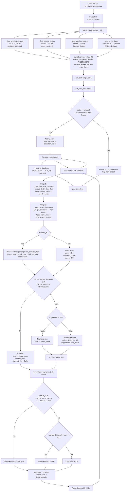
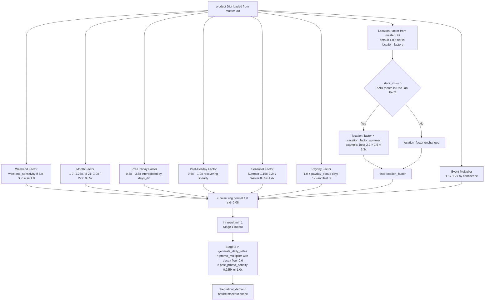
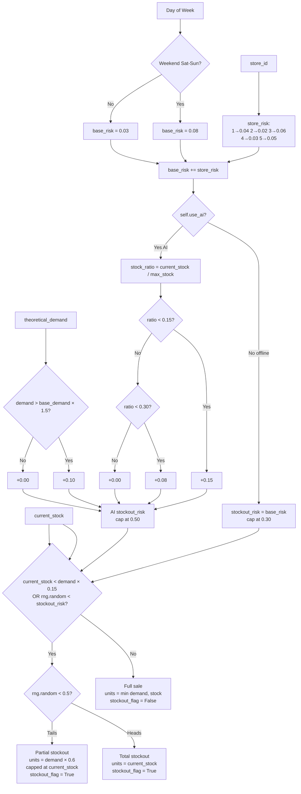
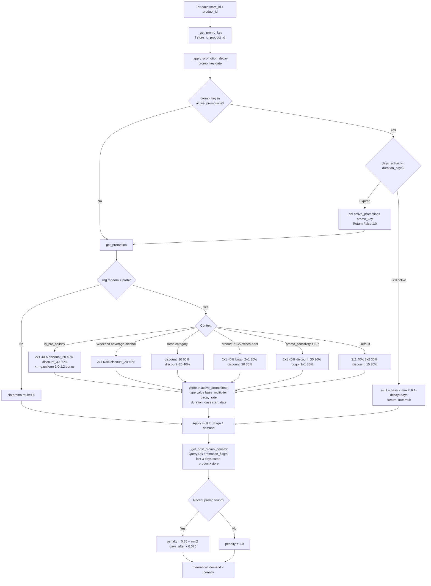
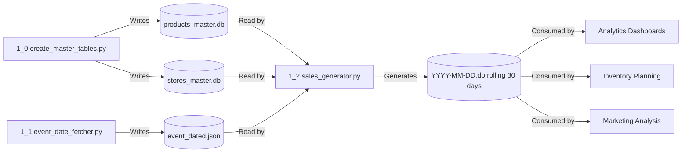

#  🛍️ Script 1_2: Sales Data Generator for Retail Analytics

  

    [](https://deepseek.com)

## 📥 Quick Downloads

| Document | Format |
| :--- | :--- |
| **🇬🇧 English Documentation** | [PDF](https://drive.google.com/file/d/1SdLvJnxcKxmQYmLlwoYttHr2Izud4iE5/view?usp=sharing) |
| **🇪🇸 Spanish Documentation** | [PDF](https://drive.google.com/file/d/11ANLX6PbK_eIzvHLPqL1rm9NY9rOshhD/view?usp=sharing) |

## 📋 General Description

This script is the **third component** of the Sales Monitoring Engine (after Script 1_0 and Script 1_1). It generates realistic daily sales data for a retail company with 5 stores and 25 products.

A key architectural change from earlier versions: **product and store data are no longer hardcoded constants**. The script loads all reference data at runtime from `products_master.db` and `stores_master.db` (generated by Script 1_0), making them the single source of truth. The script also consumes `event_dated.json` from Script 1_1 to apply demand multipliers during official e-commerce events (CyberDay, CyberMonday, Black Friday).

Output is a versioned SQLite fact table (`data/sales/YYYY-MM-DD.db`) with complete sales transaction data and all factors that influenced demand.

### Key Features

- **Master DB Integration**: Loads all product and store definitions from `products_master.db` and `stores_master.db` at runtime — no hardcoded constants
- **25 Products / 5 Stores**: 7 categories; each store has a unique demand profile loaded from master data
- **Realistic Demand Simulation**: 8 multipliers in Stage 1 + promotion + penalty in Stage 2
- **Event Date Integration**: Reads `event_dated.json` from Script 1_1; falls back to GitHub raw URL then hardcoded defaults
- **9 Types of Promotions**: 2x1, 3x2, BOGO variants (1+1, 2+1, 3+2), percentage discounts (10%, 15%, 20%, 30%)
- **Promotion Decay**: Each promotion loses 10–15% effectiveness per day; floor at 0.6×
- **Post-Promotion Penalty**: DB-backed penalty (queries `sales_data` for recent promos): ~7.5% drop day 1 after, normal day 2+
- **Idempotent Inserts**: `DELETE WHERE date = ?` before insert — safe to re-run for the same date
- **Coastal Summer Boost**: Store 5 (Vina del Mar) multiplies location factors by `vacation_factor_summer` in Dec–Feb
- **Restock Logic**: Fresh + bakery restock daily; others restock every Monday or when stock < 20% of max
- **Payday Spikes**: Calendar-aware (first 5 days + last 3 days of each month)
- **Holiday Effects**: Pre‑holiday spikes and post‑holiday recovery per product
- **Seasonality**: Summer/winter demand changes per product and store zone
- **Stockout Simulation**: Hard threshold (stock < 15% of demand) + probabilistic roll
- **DeepSeek AI Integration**: Optional enhanced stockout prediction (stock-ratio and high-demand factors)
- **Retention Policy**: Workflow auto-deletes databases older than 30 days
- **CI/CD Optimized**: Daily cron + manual `workflow_dispatch`; dedicated date-determination step

## 📊 Process Flow Diagrams

### **Legend**

| Color | Type | Description |
| :--- | :--- | :--- |
| 🔵 Blue | Input / Start | Master DBs, event dates JSON, CLI arguments |
| 🟠 Orange | Process | Demand calculation, promotion, stockout simulation |
| 🔴 Red | Decision | Conditional branching |
| 🟢 Green | Storage | SQLite fact table (`data/sales/YYYY-MM-DD.db`) |
| 🟣 Purple | External | DeepSeek API (optional) |
| 🟢 Dark Green | Output | Database committed to repository |

---

### **Diagram 1: Main Flow Overview**



**Explanation of Diagram 1:**

1. **Master DB Loading** (`__init__`): All product and store data loaded at startup from SQLite master files. `FileNotFoundError` raised immediately if either is missing — enforcing Script 1_0 as a hard prerequisite.
2. **Fact Table** (`create_fact_table`): `CREATE TABLE IF NOT EXISTS` — safe to run against an existing DB. `insert_to_database` runs `DELETE WHERE date = ?` before inserting, making runs fully idempotent.
3. **Store Status** (`get_store_status`): Checks 5 fixed total-closure holidays + Good Friday (Computus). 4 fixed early-closure dates + Maundy Thursday. Early-close base demand is scaled by `operation_factor` (0.35–0.50).
4. **Stage 1** (`_calculate_base_demand`): Receives full `product Dict` and `store Dict` from master DB. For Store 5 in Dec–Feb, additionally multiplies location factor by `vacation_factor_summer`.
5. **Stage 2** (`generate_daily_sales`): Promotion multiplier and DB-backed post-promo penalty applied after Stage 1.
6. **`FRESH_PRODUCTS = [11, 12, 13, 14, 15, 16]`**: Class-level constant — Bread, Pastries, Meat, Fruits, Vegetables, Fish restock daily. Eggs (17) does **not** restock daily.
7. **Idempotent insert**: `DELETE + to_sql(if_exists="append")` — same date can be safely regenerated.

---

### **Diagram 2: Base Demand Calculation (Stage 1)**



**Explanation of Diagram 2:**

**Important: Location Factor × Coastal Summer Boost (new in this version)**

```python
location_factor = self.location_factors.get((store["store_id"], product["product_id"]), 1.0)
if store["store_id"] == 5 and date.month in [12, 1, 2]:
    location_factor *= store.get("vacation_factor_summer", 1.0)
```

This compounds two multipliers for Store 5 in summer. Beer in Vina del Mar in January: `2.2 (location) × 1.5 (summer) = 3.3× effective factor`.

**1. Weekend Factor** — uses `product["weekend_sensitivity"]` from master DB:

| Product | weekend_sensitivity | Weekday | Sat/Sun |
| :--- | :--- | :--- | :--- |
| Beer | 2.00 | 1.0x | 2.0x |
| Meat | 1.45 | 1.0x | 1.45x |
| Bread | 1.40 | 1.0x | 1.40x |

> Only Saturday and Sunday trigger the multiplier (`date.weekday() >= 5`). Friday = weekday.

**2. Month Factor**

| Period | Factor |
| :--- | :--- |
| Days 1–7 | 1.25x |
| Days 8–21 | 1.0x |
| Days 22+ | 0.85x |

**3. Pre‑Holiday Factor**

| Holiday | Window | Peak products | Max factor |
| :--- | :--- | :--- | :--- |
| Fiestas Patrias | 15 days before Sep 18 | Meat, Wines, Beer | 3.5x |
| Christmas | 7 days before Dec 25 | Meat, Wines, Pastries | 2.8x |
| New Year | 3 days before Jan 1 | Wines, Beer | 2.5x |
| Easter | 7 days before Good Friday | Fish, Flour, Eggs | 2.8x |
| Labor Day | 3 days before May 1 | Meat, Wines, Beer | 1.5x |

**4. Post‑Holiday Factor**

| Holiday | Days post | Base factor |
| :--- | :--- | :--- |
| Fiestas Patrias | 7 | 0.70x |
| Christmas / Easter / New Year | 2–3 | 0.85x |
| Labor Day | 0 | 1.0x (no effect) |

**5. Seasonal Factor**

| Season | Product | Non-coastal | Vina del Mar |
| :--- | :--- | :--- | :--- |
| Summer (Dec–Feb) | Beer | 1.3x–1.6x | 1.8x–2.2x (then ×1.5 summer = up to 3.3x) |
| Summer (Dec–Feb) | Fruits, Vegetables | 1.15x–1.35x | 1.5x–1.8x |
| Summer (Dec–Feb) | Soda, Juices | 1.2x–1.4x | 1.5x–1.8x |
| Winter (Jun–Aug) | Yerba Mate | 1.2x–1.4x | — |
| Winter (Jun–Aug) | Grocery | 1.05x–1.15x | — |
| Winter (Jun–Aug) | All products (store 5) | — | 0.85x (winter_factor) |

**6. Payday Factor** — calendar-aware:

```python
_, last_day = calendar.monthrange(date.year, date.month)
if day <= 5 or day >= (last_day - 2):
    return 1.0 + store["payday_bonus"]
```

| Store | payday_bonus | Effect |
| :--- | :--- | :--- |
| Santiago Popular | 0.35 | +35% |
| Santiago Centro | 0.20 | +20% |
| Alto Santiago | 0.15 | +15% |

**7. Event Multiplier**

| Confidence | Range |
| :--- | :--- |
| High | 1.5x–1.7x |
| Medium | 1.3x–1.5x |
| Low | 1.1x–1.3x |
| No event | 1.0x |

**8. Promotion Multiplier (Stage 2) with Decay**

`decay_factor = max(0.6, base_multiplier × (1 - decay_rate × days_active))`

| Type | Day 1 | Day 2 | Day 3 | Day 4 |
| :--- | :--- | :--- | :--- | :--- |
| 2x1 | 1.6x | 1.36x | 1.12x | ends |
| Discount 30% | 2.2x | 1.98x | 1.76x | 1.54x |
| BOGO 1+1 | 1.8x | 1.53x | 1.26x | ends |

**9. Post-Promo Penalty (Stage 2, DB-backed)**

`_get_post_promo_penalty` queries `sales_data` for `promotion_flag=1` within last 3 days:

```python
penalty = 0.85 + (min(2, days_after) * 0.075)
```

| days_after | penalty |
| :--- | :--- |
| 1 | 0.925x |
| 2+ | 1.00x |

**10. Random Noise**

`rng.normal(1.0, 0.08)` — ≈ ±16% at 2σ, applied in Stage 1.

---

### **Diagram 3: Stockout Risk and Simulation**



**Explanation of Diagram 3:**

**Offline mode:**
```python
store_risk = {1: 0.04, 2: 0.02, 3: 0.06, 4: 0.03, 5: 0.05}.get(store_id, 0.03)
stockout_risk = store_risk + (0.05 if is_weekend else 0)
stockout_risk = min(0.3, stockout_risk)
```

**AI mode (`DeepSeekIntelligence.predict_stockout_risk`):**
```python
base_risk = 0.03 if not is_weekend else 0.08
base_risk += store_risks.get(store_id, 0.03)
stock_ratio = current_stock / max_stock
if stock_ratio < 0.15: base_risk += 0.15
elif stock_ratio < 0.30: base_risk += 0.08
if demand > product["base_demand"] * 1.5: base_risk += 0.10
return min(0.5, base_risk)
```

**Combined trigger (single `if` statement):**
```python
if current_stock < theoretical_demand * 0.15 or rng.random() < stockout_risk:
```

**Risk examples:**

| Scenario | Offline | AI mode |
| :--- | :--- | :--- |
| Weekday, Alto Santiago, 50% stock | 0.02 → **2%** | 0.03+0.02 → **5%** |
| Weekend, Santiago Popular, 10% stock | 0.06+0.05 → **11%** | 0.08+0.06+0.15 → **29%** |
| Weekend, Vina del Mar, 25% stock + high demand | 0.05+0.05 → **10%** | 0.08+0.05+0.08+0.10 → **31%** |

---

### **Diagram 4: Promotion Lifecycle**



**Promotion probability formula:**
```python
prob = 0.05
prob += 0.08 if is_weekend else 0        # +8% weekend
prob += 0.05 if day >= 25 else 0         # +5% month-end
prob += 0.10 if is_pre_holiday else 0    # +10% 1-3 days before holiday
prob += promo_sensitivity * 0.05         # product contribution
prob += promo_sensitivity_bonus * 0.5    # store contribution (can be negative)
prob = min(0.35, max(0.02, prob))
```

**Promotion types:**

| Type | base_mult | decay/day | duration |
| :--- | :--- | :--- | :--- |
| `bogo_1+1` | 1.8x | 15% | 3 days |
| `bogo_2+1` | 1.5x | 15% | 3 days |
| `bogo_3+2` | 1.3x | 15% | 3 days |
| `2x1` | 1.6x | 15% | 4 days |
| `3x2` | 1.4x | 15% | 5 days |
| `discount_10` | 1.3x | 10% | 7 days |
| `discount_15` | 1.5x | 10% | 7 days |
| `discount_20` | 1.7x | 10% | 7 days |
| `discount_30` | 2.2x | 10% | 15 days |

---

## 🔍 Detailed Analysis of `1_2.sales_generator.py`

### Architectural Change: Master DB Integration

The central change in this version: **`PRODUCTS`, `STORES`, and `LOCATION_FACTORS` are no longer Python constants**. Three private methods load them from master databases at startup:

```python
PRODUCTS_MASTER_DB = PROJECT_ROOT / "data" / "products" / "products_master.db"
STORES_MASTER_DB   = PROJECT_ROOT / "data" / "stores" / "stores_master.db"
```

| Method | Source | Returns |
| :--- | :--- | :--- |
| `_load_products_master()` | `products_master.db → products` | `List[Dict]` |
| `_load_stores_master()` | `stores_master.db → stores` | `List[Dict]` |
| `_load_location_factors()` | `stores_master.db → location_factors` | `Dict[(store_id, product_id) → factor]` |

**Consequence:** Any change to product or store definitions only requires re-running Script 1_0. Script 1_2 picks up changes automatically — no code modification needed.

**Startup log:**
```text
2026-05-13 06:00:01 - INFO - Loaded 25 products from master database
2026-05-13 06:00:01 - INFO - Loaded 5 stores from master database
2026-05-13 06:00:01 - INFO - Loaded 21 location factors
2026-05-13 06:00:01 - INFO - Sales fact table ready at data/sales/2026-05-12.db
2026-05-13 06:00:01 - INFO - Running in offline mode (no AI)
```

### Code Structure

#### **1. Holiday Configuration**

```python
TOTAL_CLOSURE = [
    ("01-01", "New Year"), ("05-01", "Labor Day"),
    ("09-18", "Fiestas Patrias"), ("09-19", "Army Day"), ("12-25", "Christmas"),
]
EARLY_CLOSURE = {
    "04-30": 0.50,   # Labor Day Eve
    "09-17": 0.45,   # Fiestas Patrias Eve
    "12-24": 0.40,   # Christmas Eve
    "12-31": 0.35,   # New Year Eve
}
```

| Holiday | Type | Factor |
| :--- | :--- | :--- |
| New Year, Labor Day, Fiestas Patrias ×2, Christmas | Total closure | 0.0 |
| Good Friday (dynamic) | Total closure | 0.0 |
| Labor Day Eve (Apr 30) | Early close | 0.50 |
| Fiestas Patrias Eve (Sep 17) | Early close | 0.45 |
| Christmas Eve (Dec 24) | Early close | 0.40 |
| Maundy Thursday (dynamic) | Early close | 0.40 |
| New Year Eve (Dec 31) | Early close | 0.35 |

#### **2. Idempotent Insert (`insert_to_database`)**

```python
cursor.execute("DELETE FROM sales_data WHERE date = ?",
               (target_date.strftime("%Y-%m-%d"),))
if not df.empty:
    df.to_sql("sales_data", self.conn, if_exists="append", index=False)
self.conn.commit()
```

The `DELETE` before insert ensures re-running for the same date never creates duplicates. Empty DataFrames (closed stores) still trigger commit — removing any previously inserted records for that date.

#### **3. Price Table (`get_price`)**

```python
base_prices = {
    1: 1200,  2: 800,   3: 1500,  4: 600,   5: 700,
    6: 500,   7: 1000,  8: 2500,  9: 1800,  10: 900,
    11: 500,  12: 2500, 13: 4500, 14: 1800, 15: 1200,
    16: 6000, 17: 400,  18: 900,  19: 800,  20: 1800,
    21: 4500, 22: 1200, 23: 1800, 24: 1200, 25: 2000
}
```

Discount applied at purchase time: `price = price * (1 - discount_pct)` for `discount_*` promotion types.

#### **4. Database Schema (Fact Table `sales_data`)**

26 columns — no physical FOREIGN KEY constraints (master DBs are separate files):

| Column | Type | Constraints | Description |
| :--- | :--- | :--- | :--- |
| `id` | INTEGER | PRIMARY KEY AUTOINCREMENT | — |
| `date` | DATE | NOT NULL | Transaction date |
| `store_id` | INTEGER | NOT NULL | Logical FK → `stores_master.db` |
| `product_id` | INTEGER | NOT NULL | Logical FK → `products_master.db` |
| `units_sold` | INTEGER | NOT NULL | Units sold |
| `price` | DECIMAL(10,2) | NOT NULL | Per unit (discounted if promo) |
| `revenue` | DECIMAL(10,2) | NOT NULL | `units × price × ticket_multiplier` |
| `stock_level` | INTEGER | NOT NULL | Stock after restock (before next day) |
| `promotion_flag` | BOOLEAN | NOT NULL | Promotion active? |
| `promotion_type` | VARCHAR(30) | — | `"2x1"`, `"discount_20"`, etc. |
| `promotion_value` | VARCHAR(10) | — | Discount % for discount types |
| `stockout_flag` | BOOLEAN | NOT NULL | Stockout occurred? |
| `day_of_week` | INTEGER | — | 1=Monday … 7=Sunday |
| `week_of_month` | INTEGER | — | 1–5 |
| `week_of_year` | INTEGER | — | ISO week 1–53 |
| `month` | INTEGER | — | 1–12 |
| `year` | INTEGER | — | Four-digit year |
| `is_holiday` | BOOLEAN | — | Store closed flag |
| `is_early_close` | BOOLEAN | — | Early closure flag |
| `operation_factor` | REAL | — | 0.35–1.0 |
| `pre_holiday_factor` | REAL | — | Pre-holiday multiplier |
| `post_holiday_factor` | REAL | — | Post-holiday multiplier |
| `seasonal_factor` | REAL | — | Summer/winter multiplier |
| `payday_factor` | REAL | — | Payday multiplier |
| `location_factor` | REAL | — | Store-product factor (with summer boost if applicable) |
| `event_multiplier` | REAL | — | CyberDay/Monday/BF multiplier |
| `created_at` | TIMESTAMP | DEFAULT CURRENT_TIMESTAMP | — |

**Indexes:**
```sql
CREATE INDEX IF NOT EXISTS idx_date ON sales_data(date);
CREATE INDEX IF NOT EXISTS idx_store_product ON sales_data(store_id, product_id);
CREATE INDEX IF NOT EXISTS idx_week ON sales_data(year, week_of_year);
```

---

## ⚙️ GitHub Actions Workflow Analysis (`1_2.sales_generator.yml`)

### Workflow Overview

```yaml
name: 1_2. Sales Data Generator

on:
  schedule:
    - cron: '0 6 * * *'   # Daily at 06:00 UTC
  workflow_dispatch:
    inputs:
      target_date:
        description: 'Target date (YYYY-MM-DD). Empty = yesterday'
        required: false
        type: string

env:
  RETENTION_DAYS: 30

permissions:
  contents: write

jobs:
  generate-sales:
    name: 📊 Generate Daily Sales Data
    runs-on: ubuntu-latest
    timeout-minutes: 20
```

**Changes vs previous version:**

| Parameter | Before | Now |
| :--- | :--- | :--- |
| Workflow name | `Sales Data Generator` | `1_2. Sales Data Generator` |
| `timeout-minutes` | 10 | **20** |
| `fetch-depth` | 0 (full) | **1 (shallow)** |
| `force_refresh` input | Yes | **Removed** (idempotency via DELETE) |
| `env: RETENTION_DAYS` | Not present | **30 days** |
| Date determination | Recalculated per-step | **Dedicated step `id: date`** |
| Run command | if/else inline | **Always `--date` from step output** |
| Retention cleanup | None | **New step** |
| Failure artifact | None | **New conditional step** |
| Final report | Basic | **Detailed `if: always()`** |

### Step-by-Step Analysis

| Step | Name | Condition | Purpose |
| :--- | :--- | :--- | :--- |
| 1 | 📚 Checkout repository | Always | Shallow clone |
| 2 | 🐍 Setup Python 3.11 | Always | With pip cache |
| 3 | 📦 Install dependencies | Always | `pandas numpy openai` |
| 4 | 📁 Create directory | Always | `mkdir -p data/sales` |
| 5 | 🎯 Determine target date | Always | Resolve once → `steps.date.outputs.target_date` |
| 6 | 🚀 Run sales generator | Always | `--date` from step 5 output |
| 7 | ✅ Verify results | Always | `ls -lah`, file count |
| 8 | 📤 Commit and push | Always | Stage specific DB, rebase, push |
| — | 📦 Upload artifacts | `if: failure()` | Debug upload |
| 9 | 🗑️ Clean old databases | `if: success()` | Delete DBs > 30 days |
| 10 | 📋 Final report | `if: always()` | Size, count, context |

#### **Step 5: 🎯 Determine Target Date**

```yaml
- name: 🎯 Determine target date
  id: date
  run: |
    if [ -n "${{ github.event.inputs.target_date }}" ]; then
      TARGET_DATE="${{ github.event.inputs.target_date }}"
    else
      TARGET_DATE=$(date -d 'yesterday' +%Y-%m-%d)
    fi
    echo "target_date=$TARGET_DATE" >> $GITHUB_OUTPUT
    echo "📅 Target date: $TARGET_DATE"
```

Resolves the date **once** and exposes it as `steps.date.outputs.target_date`. All subsequent steps use `${{ steps.date.outputs.target_date }}`, eliminating race conditions around midnight that affected the previous approach of recalculating per-step.

| Trigger | Value |
| :--- | :--- |
| Cron | Yesterday |
| `workflow_dispatch` (no input) | Yesterday |
| `workflow_dispatch` with `target_date: 2026-05-10` | `2026-05-10` |

#### **Step 6: 🚀 Run Sales Generator**

```yaml
- name: 🚀 Run sales generator
  env:
    DEEPSEEK_API_KEY: ${{ secrets.DEEPSEEK_API_KEY }}
  run: |
    python scripts/1_2.sales_generator.py --date ${{ steps.date.outputs.target_date }}
```

Always passes `--date` explicitly. The `force_refresh` input has been removed — idempotency is now guaranteed by `DELETE WHERE date = ?`.

#### **Step 7: ✅ Verify Results**

```yaml
- name: ✅ Verify results
  run: |
    DB_FILE="data/sales/${{ steps.date.outputs.target_date }}.db"
    ls -lah $DB_FILE 2>/dev/null || echo "❌ Database not found"
    
    find data/sales -type f -name "*.db" -exec ls -lh {} \; 2>/dev/null | tail -5 | awk '{print $5, $9}'
    
    find data/sales -type f -name "*.db" 2>/dev/null | wc -l
```

Shows the target DB, the 5 most recent files, and total count. Does not query `sqlite3` row count (removed for speed).

**Expected output:**
```text
-rw-r--r-- 1 runner runner 36K May 13 05:27 data/sales/2026-05-12.db
36K  data/sales/2026-05-12.db
15
```

#### **Step 8: 📤 Commit and Push**

```yaml
- name: 📤 Commit and push database to repository
  run: |
    git config user.name "github-actions[bot]"
    git config user.email "github-actions[bot]@users.noreply.github.com"
    
    DB_FILE="data/sales/${{ steps.date.outputs.target_date }}.db"
    git add $DB_FILE
    
    if git diff --cached --quiet; then
      echo "🔭 No changes to commit"
    else
      git commit -m "🛍️ Add sales data for ${{ steps.date.outputs.target_date }} [automated]"
      git pull --rebase origin main
      git push origin HEAD:main
    fi
```

Stages only the specific day's `.db` (not all of `data/sales/`). `git pull --rebase` prevents conflicts when Script 1_1 has pushed to `main` since checkout.

#### **Step 9: 🗑️ Clean Old Databases**

```yaml
- name: 🗑️ Clean old databases (retention policy)
  if: success()
  run: |
    find data/sales -type f -name "*.db" -mtime +${RETENTION_DAYS} -exec rm -v {} \;
    
    git add data/sales/
    if git diff --cached --quiet; then
      echo "🔭 No old files to clean"
    else
      git commit -m "🧹 Remove sales data older than ${RETENTION_DAYS} days [automated]"
      git pull --rebase origin main
      git push origin HEAD:main
    fi
```

Only runs on `success()`. Uses `find -mtime +30` to delete files older than `RETENTION_DAYS`. Commits deletions separately if any files were removed. This keeps the repository at ≤ 30 databases (~1.1 MB).

**Repository size effect:**

| Policy | DBs kept | Approx size |
| :--- | :--- | :--- |
| 30 days retention (current) | ≤ 30 | ~1.1 MB |
| No cleanup | 365 | ~13 MB |

#### **Failure Artifact Upload**

```yaml
- name: 📦 Upload artifacts (on failure)
  if: failure()
  uses: actions/upload-artifact@v4
  with:
    name: sales-db-debug-${{ github.run_number }}
    path: data/sales/
    retention-days: 7
```

Fires only on failure. Uploads all `data/sales/` content as `sales-db-debug-{run_number}` for 7 days of debugging.

#### **Step 10: 📋 Final Report**

```yaml
- name: 📋 Final report
  if: always()
  run: |
    echo "📅 Date: $(date)"
    echo "📌 Trigger: ${{ github.event_name }}"
    echo "🔗 Commit: ${{ github.sha }}"
    echo "🎯 Target date: ${{ steps.date.outputs.target_date }}"
    DB_FILE="data/sales/${{ steps.date.outputs.target_date }}.db"
    [ -f "$DB_FILE" ] && echo "✅ Sales database: $(($(stat -c%s $DB_FILE) / 1024)) KB" \
                      || echo "❌ Sales database not found"
    echo "📦 Total historical databases: $(find data/sales -type f -name "*.db" | wc -l)"
```

Runs `if: always()` — even after failures. Prints trigger (`schedule` or `workflow_dispatch`), commit SHA, target date, DB size in KB, and total DB count.

### Cron Schedule

```cron
'0 6 * * *'
│ │ │ │ │
│ │ │ │ └─── Day of week: * = any
│ │ │ └───── Month: * = any
│ │ └─────── Day: * = any
│ └───────── Hour: 6 (06:00 UTC)
└─────────── Minute: 0
```

Generates data for **yesterday** — the previous day is always complete by 06:00 UTC.

### Required Secrets and Variables

| Name | Type | Purpose | Required? |
| :--- | :--- | :--- | :--- |
| `DEEPSEEK_API_KEY` | Secret | AI stockout prediction | No |
| `RETENTION_DAYS` | Workflow env var | DB retention window | Hard-coded to 30 |

---

## 🚀 Installation and Local Setup

### Prerequisites

- Python 3.11+, `pandas`, `numpy`, `openai`
- Script 1_0 must have been run (master DBs must exist)
- DeepSeek API key (optional)

### Steps

```bash
# 1. Clone
git clone https://github.com/adroguetth/Sales-Monitoring-Engine.git
cd Sales-Monitoring-Engine

# 2. Run Script 1_0 first
python scripts/1_0.create_master_tables.py

# 3. Install dependencies
pip install pandas numpy openai

# 4. Set API key (optional)
export DEEPSEEK_API_KEY="sk-xxx"

# 5. Run
python scripts/1_2.sales_generator.py                      # Yesterday
python scripts/1_2.sales_generator.py --date 2026-05-10   # Specific date
python scripts/1_2.sales_generator.py --db ./custom.db    # Custom path
python scripts/1_2.sales_generator.py --year 2026         # Event year

# 6. Verify
sqlite3 data/sales/2026-05-12.db "SELECT COUNT(*) FROM sales_data;"
# Expected: 125
```

---

## 📁 Generated File Structure

```text
Sales-Monitoring-Engine/
├── data/
│   ├── products/
│   │   └── products_master.db       # Input: Script 1_0
│   ├── stores/
│   │   └── stores_master.db         # Input: Script 1_0
│   ├── event_date/
│   │   └── event_dated.json         # Input: Script 1_1
│   └── sales/
│       ├── 2026-05-11.db            # ~36 KB, 125 records
│       ├── 2026-05-12.db            # ~36 KB, 125 records
│       └── ... (rolling 30-day window)
├── scripts/
│   ├── 1_0.create_master_tables.py
│   ├── 1_1.event_date_fetcher.py
│   └── 1_2.sales_generator.py
└── .github/workflows/
    └── 1_2.sales_generator.yml
```

---

## 🔧 Customization and Configuration

### Adjustable Parameters

| Parameter | Where | Default | How to change |
| :--- | :--- | :--- | :--- |
| Products / stores / location factors | `products_master.db`, `stores_master.db` | 25 products, 5 stores, 21 factors | Edit Script 1_0 and re-run |
| `TOTAL_CLOSURE_HOLIDAYS` | `get_store_status()` | 5 fixed + Good Friday | Edit Script 1_2 |
| `EARLY_CLOSURE_HOLIDAYS` | `get_store_status()` | 4 dates + Maundy Thursday | Edit Script 1_2 |
| `RETENTION_DAYS` | Workflow env var | 30 | Edit `.yml` file |
| Promotion probabilities | `get_promotion()` | See Diagram 4 | Adjust `prob` formula |

---

## 🐛 Troubleshooting

| Error | Likely Cause | Solution |
| :--- | :--- | :--- |
| `FileNotFoundError: products_master.db not found` | Script 1_0 not run | Run `python scripts/1_0.create_master_tables.py` |
| `FileNotFoundError: stores_master.db not found` | Script 1_0 not run | Run `python scripts/1_0.create_master_tables.py` |
| `No such table: sales_data` | DB creation failed | Check write permissions; check logs |
| `Units sold = 0 for all records` | Store closed (holiday) | Check if date is a total closure holiday |
| `event_dated.json not found` | Script 1_1 not run | Script auto-downloads from GitHub raw URL |
| `DeepSeek API call failed` | Invalid key | Verify `DEEPSEEK_API_KEY`; script falls back to offline mode |
| Duplicate records | Old version without DELETE | Run `DELETE FROM sales_data WHERE date = 'YYYY-MM-DD'` manually |

### Query Examples

```bash
sqlite3 data/sales/2026-05-12.db

SELECT COUNT(*) FROM sales_data;                                          -- Expect 125
SELECT store_id, SUM(units_sold), SUM(revenue) FROM sales_data GROUP BY store_id;
SELECT promotion_type, COUNT(*) FROM sales_data WHERE promotion_flag=1 GROUP BY promotion_type;
SELECT stockout_flag, COUNT(*) FROM sales_data GROUP BY stockout_flag;
SELECT event_multiplier, AVG(units_sold) FROM sales_data GROUP BY ROUND(event_multiplier,1);
```

---

## 📈 Monitoring and Maintenance

### Health Indicators

| Metric | Expected | Alert threshold |
| :--- | :--- | :--- |
| Records per day | 125 | < 120 |
| Database size | ~36 KB | < 30 KB |
| Execution time | 2–10 s | > 60 s |
| Stockout rate | < 10% | > 20% |
| Promotion rate | 15–25% | < 10% |
| DBs in repository | ≤ 30 | > 35 |

---

## 🔗 Dependencies and Integration

### Upstream Dependencies

| Script | Output | Used for |
| :--- | :--- | :--- |
| `1_0.create_master_tables.py` | `products_master.db`, `stores_master.db` | All product/store/location data |
| `1_1.event_date_fetcher.py` | `event_dated.json` | Event dates and confidence |

### Integration Flow



---

## 📄 License and Attribution

- **License**: MIT
- **Author**: Alfonso Droguett
  - 🔗 **LinkedIn:** [Alfonso Droguett](https://www.linkedin.com/in/adroguetth/)
  - 🌐 **Web portfolio:** [adroguett-portfolio.cl](https://www.adroguett-portfolio.cl/)
  - 📧 **Email:** adroguett.consultor@gmail.com
- **Dependencies**: Pandas (BSD 3-Clause), NumPy (BSD 3-Clause), OpenAI SDK (Apache 2.0)

---

## 🤝 Contribution

1. To change product/store data: edit Script 1_0 and re-run it — never hardcode constants in Script 1_2
2. To add holidays: update `get_store_status()`, `PRE_HOLIDAY_EFFECTS`, and `POST_HOLIDAY_EFFECTS` consistently
3. Keep the `DELETE WHERE date = ?` idempotency guarantee in `insert_to_database`
4. Maintain realistic multiplier ranges (0.5×–3.5×)
5. Keep `FRESH_PRODUCTS` in sync with Script 1_0 category definitions
6. Test locally: verify `sqlite3 "SELECT COUNT(*) FROM sales_data;"` = 125

---

**⭐ If this project is useful to you, please consider giving it a star on GitHub!**
